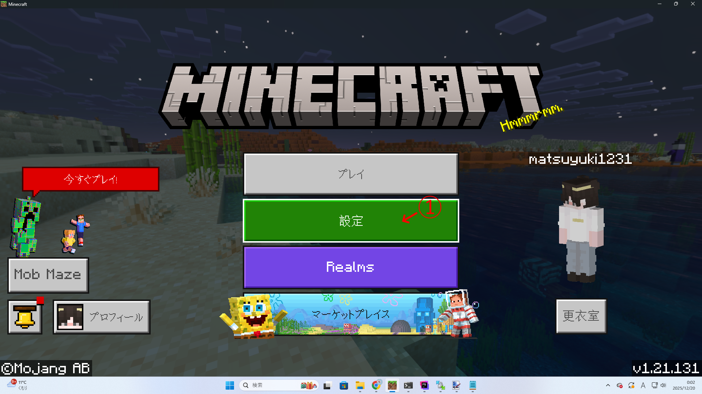
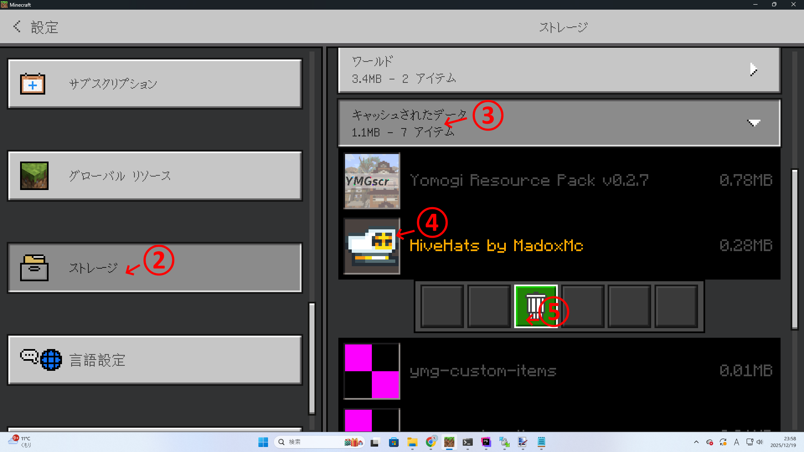

# v1.21.130更新に起因するテクスチャ破損について

Minecraftのバージョンを1.21.130に更新した際、よもぎサーバーから配布されたテクスチャが破損する事象が発生しています。  
これにより運営は全テクスチャパックを再ダウンロードさせる措置を講じましたが、一部ユーザーの端末においては引き続き再ダウンロードが行われないとの報告が入っています。  
このブログでは、当該ケースに該当する方が破損したテクスチャを手動で再ダウンロードする方法と、破損したテクスチャを使用した場合に起こりうる問題について解説します。

<!-- truncate -->

## テクスチャの手動再ダウンロード方法

➀ Minecraftトップ画面から「設定」をタップします  
②「ストレージ」を選択します  
③「キャッシュされたデータ」を選択します  
④「HiveHats by MadoxMc」と書かれた項目を選択します  
⑤削除マークをクリックして当該項目を削除します  
⑥サーバーに再参加します  

## 破損済みテクスチャを使用した場合

破損したテクスチャを使用した場合でも恒常的な損害を被る可能性はありませんが、再ダウンロードまでの間、以下の事象が発生する場合があります。  
 - よもぎ端末のテクスチャが透明になる(報告済み)
 - 帽子のテクスチャが透明になる(報告済み)
 - §h〜§uまでのカラーコードの色が通常と異なるものになる(報告済み)
 - ミッションを追跡している場合でも画面右上に追跡の表示が成されない(未報告)
 - 通常ミッション/隠しミッションのクリア時に音が鳴らない(未報告)
 - bgmが2重で再生される(未報告)

## 手動再ダウンロードでも治らない場合

異常が手動再ダウンロードで解決できない場合、④で削除する項目を変えてみてください。  
よもぎ端末のテクスチャが透明になる → 「ymg-custom-items」を削除してください。  
§h〜§uまでのカラーコードの色が通常と異なるものになる、ミッションを追跡している場合でも画面右上に追跡の表示が成されない → 「Yomogi Resource Pack v0.2.7」を削除してください。  
通常ミッション/隠しミッションのクリア時に音が鳴らない → 「Yomogi Resource Pack v0.2.7」「ChallengeComplete」を削除してください。  
bgmが2重で再生される → 「Yomogi Resource Pack v0.2.7」「change music def」を削除してください。  

お手数をおかけすることをお詫びします。