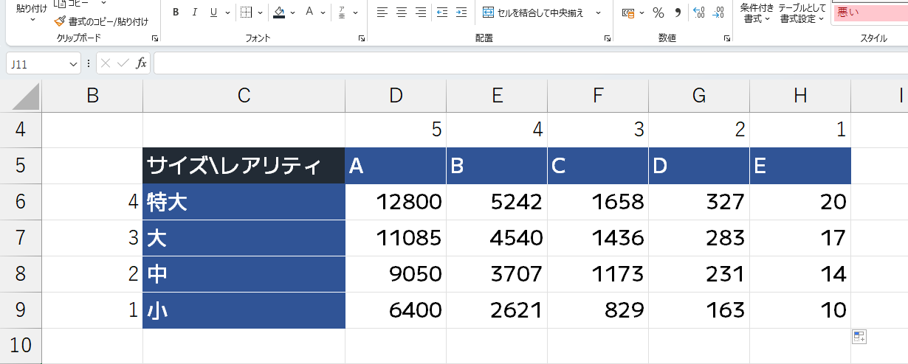

# 期間限定鯖から通常サーバーへの移行を行いました

おはようございます。いい天気ですね。  
さて、私たちが2025年12月27日から提供していた期間限定鯖について、2026年2月1日をもってその公開を終了しました。  
期間限定鯖で導入されていた機能を通常の生活鯖でも導入するのかについては「運営内で協議の上あらためてご案内する」とお伝えしていましたが、2月8日の運営会議にて方針が定まりましたので、ご案内します。

<!-- truncate -->

## お伝えしていたデータを移行しました

期間限定サーバーのデータのうち移行するとお伝えしていた所持金、life4の土地と建物、ログイン時間について、加算およびデータの移行を行いました。  
また、life4に設営されたチェストショップ、チェストロックについてもデータの移行を行っています。  
ただし、土地番号とチェストショップIDについては既存の生活鯖のものと重複してしまいますので、新たな番号を割り振りしています。  
なお、ドア保護、有人レジも移行の対象となっていましたが、これらは設営が認められませんでした。

## 「釣り」機能を導入します

期間限定サーバーで導入していた釣り機能を従来の生活サーバーでも導入します。  
仕様については期間限定サーバーのものと相違ありませんが、ここで再度申し上げておきますと、公式ショップ(/shop)で購入した釣竿を水に向けて投げると、バニラと同じ要領で釣りができる機能となっています。  
ただし、釣れる魚や物品についてはバニラのものとは異なっており、全部で275種類あります。  
相当いろいろな種類の魚が釣れると伺っていますので、是非遊んでみてください。  

## 「魚の売却」機能を導入します

期間限定サーバーで導入していた魚の売却機能を従来の生活サーバーでも導入します。  
仕様については期間限定サーバーのものと相違ありませんが、ここで再度申し上げておきますと、鯖内で/sellfishのコマンドを打つか、よもぎ端末の「ショップ」から「魚(売却専用)」を選び、売りたいアイテムを上部に移動させることで売却ができる機能となっています。  
なお、売却価格については以下の画像をご覧ください。

## 「エンチャント」機能を導入します

期間限定サーバーで導入していたエンチャント機能を従来の生活サーバーでも導入します。  
仕様については期間限定サーバーのものと相違ありませんが、ここで再度申し上げておきますと、後述する役職制度にて「エンチャンター」役職に就いたうえで、鯖内で/enchantのコマンドを打つことで自身が所有するツールにエンチャントができる機能となっています。  
エンチャントは同じく所有しているエンチャント本を用いて行います。エンチャント本は、適正役職での採掘(「木こり」役職に就いて原木を採掘するなど)、釣り、ガチャを行った際に低確率で入手できます。  
なお、「エンチャンター」役職に就いている場合は全不透明ブロック（土、石、木材など）を採掘した際に低確率でエンチャント本を入手することができます。  
エンチャントに費用は掛かりません。ただし、エンチャントは「失敗」することがあります。失敗すると、エンチャント本とツールの両方を失います。  
失敗確率はコマンド実行時に表示されます。

## 「役職制度」を導入します

期間限定サーバーで導入していたエンチャント機能を従来の生活サーバーでも導入します。  
ただし、役職変更価格と変更インターバル(24時間に1回までしか変更できないという制限)は撤廃し、無料で何度でも変更ができるようになります。  
また、適正役職以外が資源系ワールドでブロックを採掘できない制限、公式ショップでアイテムを売買できない制限、チェストショップでアイテムを販売できない制限についても、同じく撤廃します。  
役職はよもぎ端末の「役職変更」から、もしくは、鯖内で/roleを実行することでも変更できます。  
全員の初期役職が「鯖民」となっていますので、サーバー参加後に役職を変更してください。「鯖民」のままですと、いずれのブロックを採掘しても報酬が得られません。
役職の種類については期間限定サーバーのものと相違ありませんが、以下に再掲しておきます。
### 鯖民
初期役職で、全ワールドに制限なしにTPできます
### 木こり
原木や木材を採掘した際に5YGと、低確率でエンチャント本を得ることができます
### 採掘者
石を採掘した際に2YGを、鉱石を採掘した際に3-20YGを得ることができるほか、これらのブロックの採掘時に低確率でエンチャント本を入手できます
### 農家
スイカとかぼちゃを採掘した際に3YGを得ることができるほか、小麦、サトウキビ、スイカ、かぼちゃの採掘時に低確率でエンチャント本を入手できます
### エンチャンター
エンチャント本を用いたエンチャントができるほか、全固形ブロックの採掘時に低確率でエンチャント本を入手できます

## 設定項目「適正役職以外でブロックを採掘した際に勧告文を表示する」を追加します

/settingで設定できる項目に「適正役職以外でブロックを採掘した際に勧告文を表示する」を追加します。  
役職制度の導入に伴い、適正役職以外がブロックを採掘した際に報酬を得ることができなくなったことに由来する勧告文が追加されましたが、こちらの表示可否を設定できます。

## ミッション「自分だけができること」を追加します

役職制度導入に伴い、チュートリアルミッション「自分だけができること」を追加します。  
役職を鯖民以外のものに変更することで200YGが入手できるミッションです。

## 「近距離VC参加必須」制限は廃止します

期間限定サーバーで導入していた「近距離VC参加必須」の制限は廃止します。  
ただし、近距離VC自体は現在でもご利用になれます。

## 「近距離チャット」機能は廃止します

期間限定サーバーで導入していた「近距離チャット」機能は廃止します。  
現在は計算機能を除くすべてのチャットが全員に送信されます。

## 期間限定鯖で導入されていた一部ミッションを廃止します

期間限定鯖で導入されていたチュートリアルミッション「みんなに聞こえる声で」と隠しミッション「空ぶって届かない声」は、近距離チャット廃止に伴い削除しました。

## 採掘報酬を廃止します

従来の採掘報酬制度は、役職制度が機能を代替するため廃止します。

## Discord「サービス提供状況」の「期間限定生活サーバー」項を削除します

期間限定鯖公開終了に伴い、よもぎサーバー公式Discordの「サービス提供状況」チャンネルで示されていた「期間限定生活サーバー」項を削除します。  
期間限定鯖公開終了後は、当該項は「ホワイトリスト」表示でした。

## life4の土地購入制限を廃止します

life4に導入されていた、一人一つまでしか土地を購入できないという制限を廃止します。

## 土地の販売価格を変更します

同一ワールドに2つ目以降の土地を購入する際の販売価格を変更します。  
2つ目以降の土地購入に際して、販売価格は1+(今所有している土地の数)*0.2倍になります。  
例えば、life1に2つ目の土地を購入する際の価格は120YG/m^2、3つ目の土地を購入する際の価格は140YG/m^2です。  
ただし、売却価格は従来から変更ありません。  
また、土地所有数が少ないプレイヤーから多いプレイヤーに土地の譲渡(/landgive)を行う際は、購入価格の差分を譲渡元のプレイヤーが支払う必要があります。  
なお、土地所有数が多いプレイヤーから少ないプレイヤーに土地を譲渡する際の差分の返金はありません。

## 新ワールド「life4」を追加します

期間限定鯖からのデータ移行に伴い、従来のサーバーには新しい生活系ワールド「life4」が追加されます。  
1つ目の土地を購入する価格はlife1と同じ100YG/m^2、土地の売却価格は98YG/m^2です。  
なお、期間限定鯖では購入できる土地の数に(現在は撤廃済みの)制限を設けていましたので、life4にはまだ多くの空き地があります。  
是非ご活用ください。  

それでは、おやすみなさい。