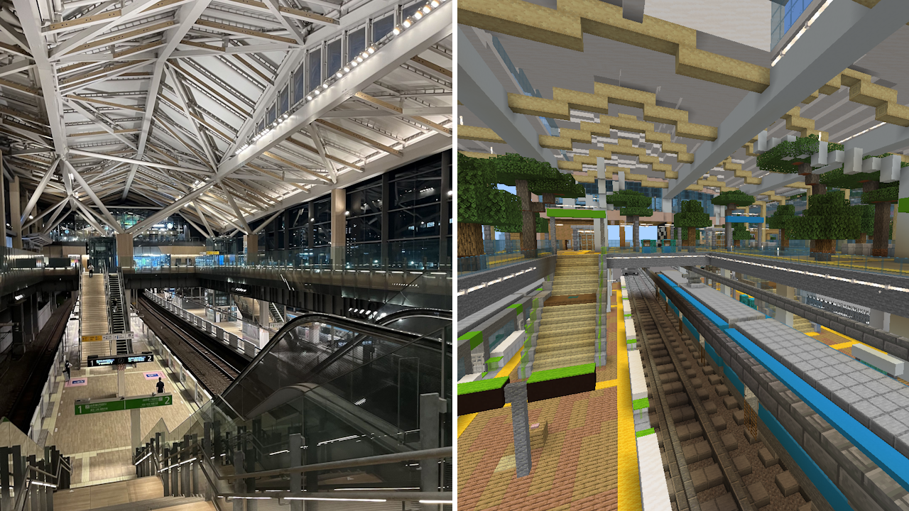
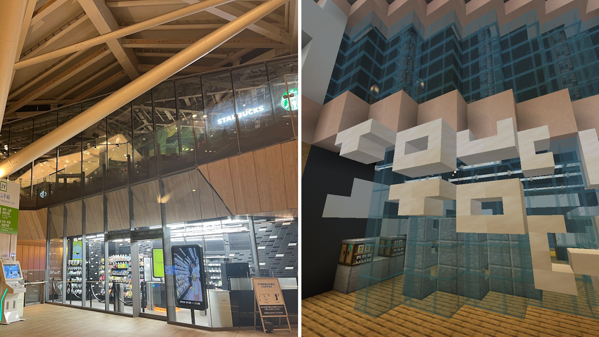
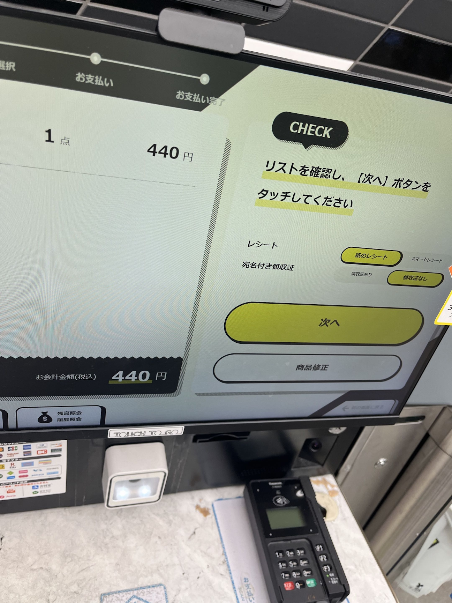
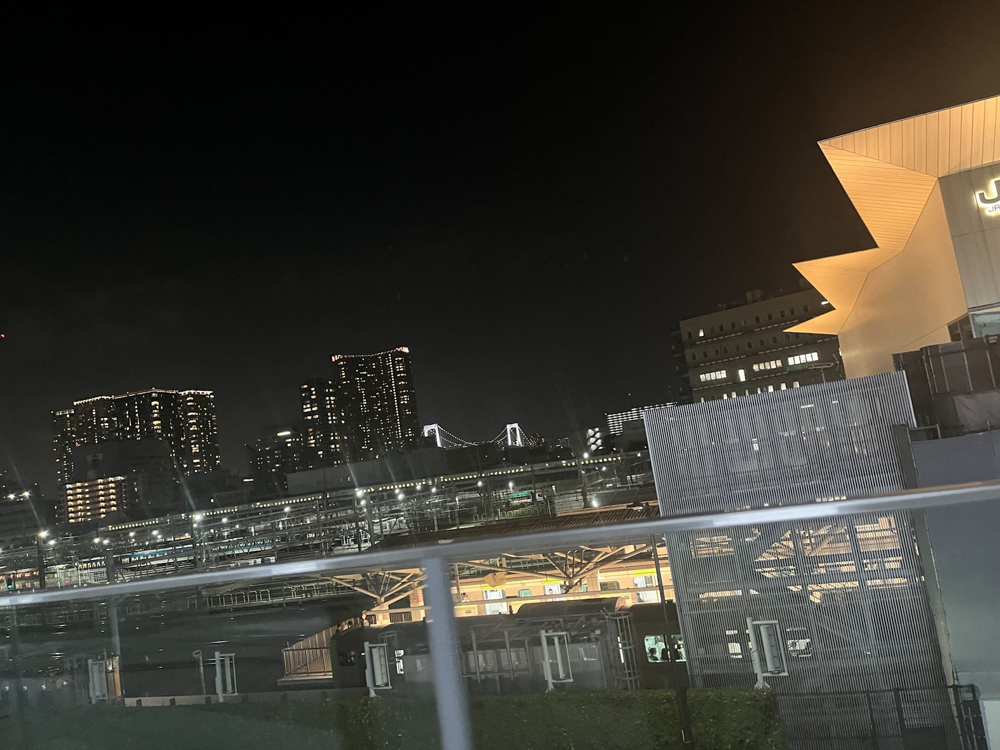
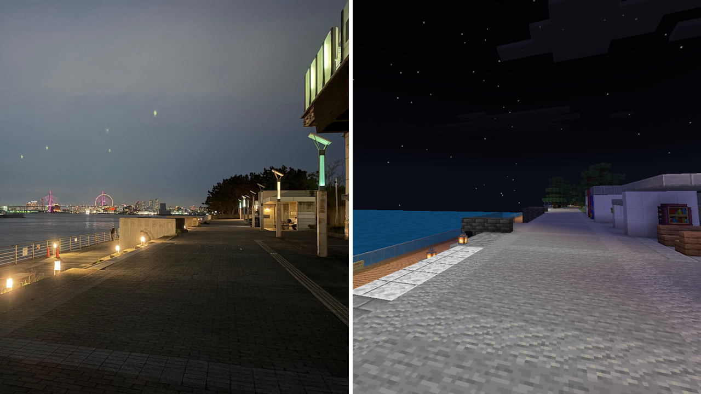
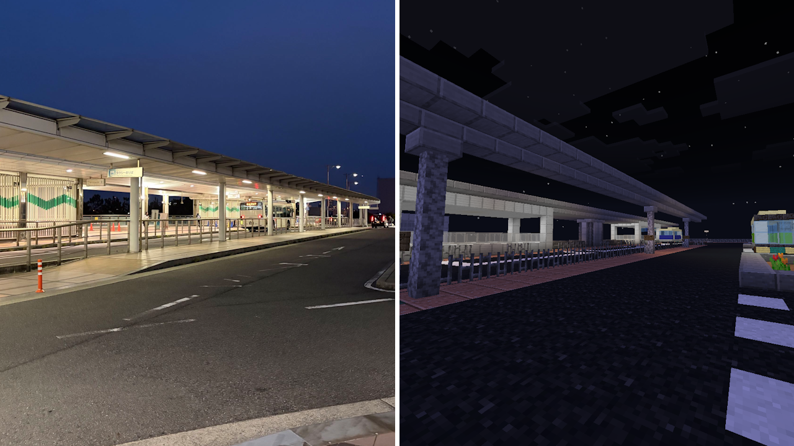
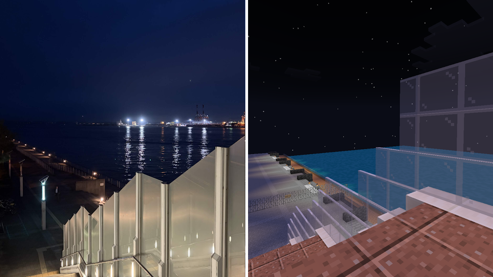
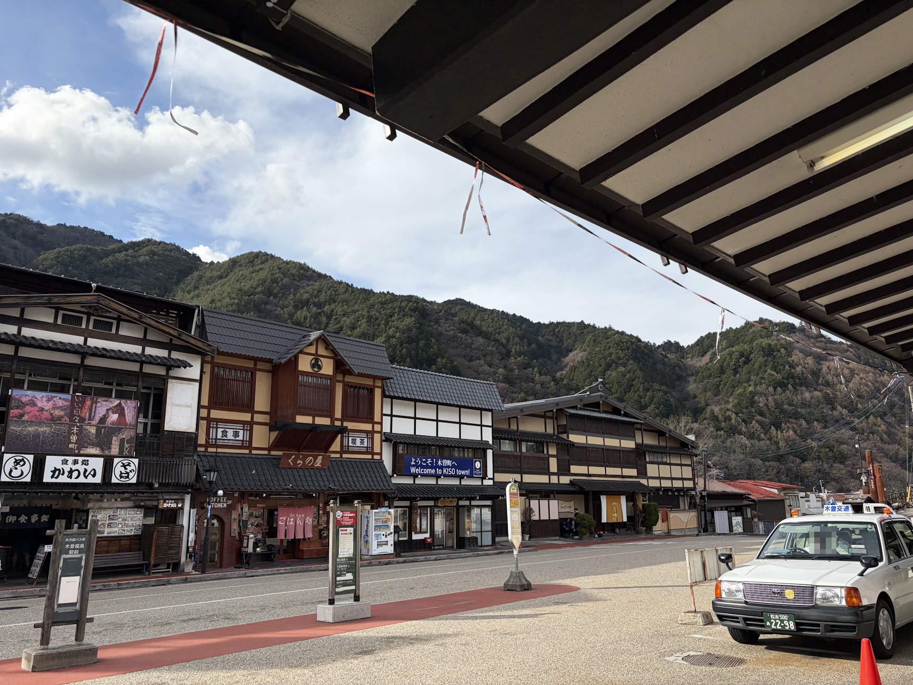
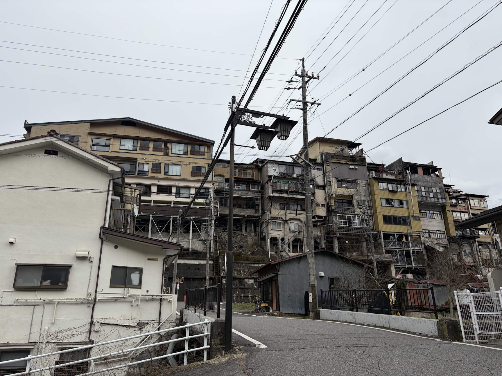
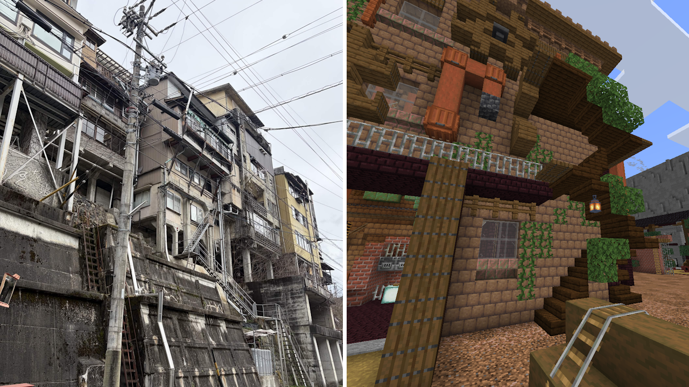

# 人狼のステージ、聖地巡礼してみた

土曜日の22:30以降に行われるAdvanced人狼では、ステージが全14種類の中からランダムで選ばれます。  
さて、このステージのうちいくつかは現実世界の場所がモデルになっているって知っていましたか？

今回は全14種類のステージのうち、モデルが存在する3ステージを聖地巡礼してみましたので、その様子をお届けできればと思います。

<!-- truncate -->

## 1. 東京都 高輪ゲートウェイ駅 (高輪ゲートウェイ)

「高輪ゲートウェイ」ステージはその名の通り、東京都にある「高輪ゲートウェイ駅」というJR山手線/京浜東北線の駅がモデルとなっています。

サボタージュの一つである「Touch To Go」は高輪ゲートウェイ駅に実在するコンビニの名前です。

客がどの商品を手に取ったのかをAIが分析し、レジに向かうと自動で購入品目と会計金額が表示されるというとても近未来的なコンビニで、オープン当初はとても話題になりました。  
この店を機にTouch To Goは全国に拡大し、現在は全国に250店舗以上を展開しているそうです。(参考: https://ttg.co.jp/)  

駅の外からは東京都心のオフィスビルが一望できます。この画像を撮った頃の駅周辺は車庫と工事現場しかなくとても閑散とした駅だったのですが、近年になり駅と周辺を一体化したまちびらき「TAKANAWA GATEWAY CITY」の開発がすすめられ、賑わいが生まれつつあります。

## 2. 大阪府 シーサイドコスモ (海浜緑地)

一方こちらは高輪ゲートウェイ駅から直線距離で407km離れた大阪市住之江区。ここには「海浜緑地」ステージのモデルとなった「シーサイドコスモ」と「大阪メトロ コスモスクエア駅」があります。  

コスモスクエア駅の周辺一帯を含む南港の埋立地はかつて「テクノポート大阪計画」の中で都市機能を集約した新都心となる予定でした。  
しかしながらバブル崩壊などの影響を受け開発が停滞し、大阪府は開発方針を転換しました。現在の駅周辺にはタワーマンションや大学、庁舎施設が立ち並んでいます。  

上の実物写真の奥に見えるコンテナ港はかつて関西万博の会場であった「夢洲」です。コスモスクエア駅は夢洲駅の隣にあります。  
この画像には映っていませんが、シーサイドコスモからは天保山の観覧車や海遊館も望むことができます。  
万博の前後で変わらず、多くの人に利用され続けている駅です。  

## 3. 長野県 木曽町 (DXシルバニアファミリー)

こちらはモデルというほどではありませんが、おまけとして紹介しておきます。

長野県木曽町にある木曽福島駅周辺は、江戸時代に中山道の宿場として栄えた歴史を持つ、現在も観光地として有名な場所です。  
駅前には上の画像の通りとても整然とした建物が並んでいるのですが、この建物を裏から見ると...

まるで篭城のような印象を受ける建物になります。

DXシルバニアは廃工場をモチーフにしたステージですが、この通路やベランダが密集しあった雰囲気はこの木曽町の雰囲気がもとになっているとのこと。

せっかくなので上の画像で映っていた「食事処 かわい」さんでそばをいただいてきました。
木曽町を含む信州は「信州そば」でおなじみそばが有名です。

スタッフの方もとても親切に接して下さりました。木曾福島駅を訪れた際は是非行ってみてください。

## おわりに

オフ会などを開催するときがあれば聖地巡礼してみてもおもしろいかも...？

