おはようございます。  
20:30にお寿司屋を予約して現在18:54、腹が減ってきて低血糖  
でーしーです。
 
息抜きでちょっと変なものを開発したので、紹介がてら  
よもぎサーバー周辺の技術者や、よもぎのシステムを助けるClaude君と従者たち等への  
有益な情報になったらうれしいなと思って書きます。  

さてさっそく何を作ったか？からお話の始まり

# マイクラ内で、阿部寛のホームページを開きたい！
じゃーん。   
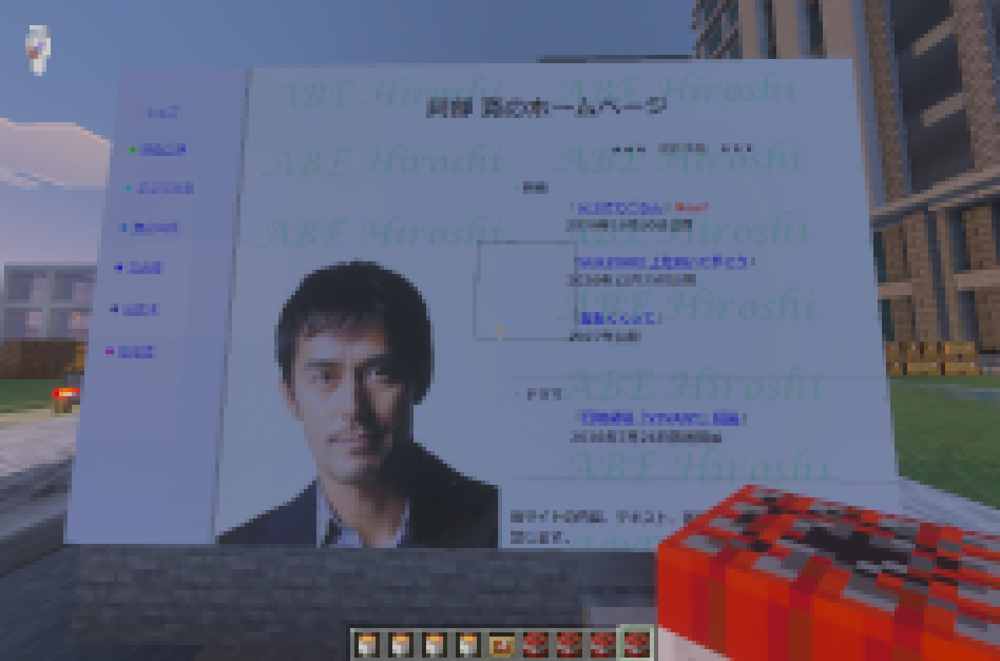

<!-- truncate -->

(権利関係が怖いので、モザイクかけました。ひよった。。。)  
## 経緯(?)

爆速で有名な阿部寛のホームページ。  
[阿部寛のホームページ](https://abehiroshi.la.coocan.jp/)  
スマホゲームのグリッチで表示させてみたり  
「入力欄にHTMLが使えるぞ！」と気づいちゃった人が表示させてみたり  
そういった手法と動画、スクショがTwitter(X)でよく出回った時期がありました。  

実はマイクラでもその実績があり、Java版のModではゲーム内でブラウザを使用できるなんてのも出回っています。  

そこでふと。  

PowerNukkitX(以下、PNX)のプラグインで 阿部寛のホームページを見たいな。。**息抜きに。**  
ってことで作ってみました。  

といっても、5年前にNukkit(懐かしい)向けのプラグインとして  
作成した実績があり、過去の遺物を見つけたので、それをベースにPNX版を作ろう  
ということで思い立ちました。  

## 初期案の構想

まず、PNX(当時はNukkit)というか よもぎサーバーで実績ある手法として  
「地図に画像を表示する」 というところが一番有力です。  
その地図を額縁に飾ることで、額縁がWeb画面を映すモニターのような見た目になります。  

ただ、画像を表示するだけでは、事前にWeb画面のスクリーンショットを準備して  
何かのタイミングをトリガーに表示する... というのは最初に思いつきました。  
ただ、それでは阿部寛のホームページを表示させるためのブラウザ的な機能  
というよりは、ただのデジタルサイネージやなぁと。  

要するに、超面白くない内容になってしまうので、ちょっとひと工夫したいなと。。  

ということでひと工夫。  
「Web画面を表示して、実際に操作できる」 機能を目指して作ることにしました。  

## 最初の課題

### そもそも、Webページをマイクラの地図に表示するってどうやる？

話の前提として、Webページを表示するということは  
サーバーからHTML、CSS、JavaScriptや画像等を取得し、  
取得した各内容を解釈したうえで、人間の目に見える画面として描画するということです。  
(ここがイマイチわからないよ！って人は、Googleで「HTMLとは？」って調べてみよう！)  

JavaだからWebページを表示できない、というわけではありません。  
ただ、PNX自体にはHTMLやCSSを解釈するブラウザエンジンが入っておらず、  
Chromium相当の機能をプラグインへ直接組み込むと、native依存、メモリ使用量、  
サーバー本体の機能を止めない工夫など、考えることが一気に増えます。  

そこで、別プロセスの「中継システム」も作ることにしました。  
これを `BrowserService` とします。 ちょっとカッコよくなってきたね。  
BrowserServiceからPlaywrightを使って **Chromium** を操作し、  
Webページの描画とスクリーンショット生成を任せます。  

### それぞれが持つ知識の制御

PNX側は、HTMLもDOMも知りません。  
同様に、Chromiumを動かすプログラム側は、マイクラの額縁が何ぞやとか、  
プレイヤーの動きがどうだ、地図がどうだ、ということは知りません。

PNXユーザー(サーバーに接続したプレイヤー)から見えるのは、額縁とURLを指定したら  
その額縁に入った地図にWeb画面が表示される　という動きです。  
逆にBrowserService側がマイクラについて知っているのは、  
決められたviewportの大きさと、navigateやclick等の操作命令だけです。  

ここに境界を置くことで、PNXプラグインは額縁・地図・プレイヤー操作を担当し、  
BrowserServiceはWebページの描画を担当する、という形で役割と責任を分離できました。  

### セキュリティ面の確保

もう一つ必要な話として、セキュリティは大事です。  
公開予定のないお遊び機能にそこまでやるか？ という感じもしますが、  
やはりブラウザとしては必須の要件でしょう。  

ブラウザでホームページを開けるということは、悪用されると サーバー内から  
次のようなアクセスができてしまいます。  

- localhost  
- LAN内の管理画面(PNXをWindowsで動かしてたら。。。)
- クラウド環境のmetadata endpoint
- DNS応答をpublic IPからprivate IPへ差し替えるDNS rebinding  

...などの悪意ある手法が可能になってしまいます。。  

そこで、Chromiumの通信をすべてSecurityProxyに通すように考えました。  

SecurityProxyは接続前にDNSを解決し、  
結果にprivate、loopback、link-local等のIPが含まれていないか検査します。  
許可したあとはホスト名をもう一度名前解決させず、検査済みのIPへ直接つなぎます。  
これで「検査時はpublic IP、接続時はprivate IP」というDNS rebindingを防ぎます。  

URL自体も `http:` と `https:` だけを許可し、ユーザー名やパスワードを埋め込んだURLは拒否します。  
さらにPlaywright側のroutingでも、最初のdocumentだけでなく、  
redirect、画像、JavaScript等のsubresourceをリクエストごとに検査します。  

- Playwright：リクエストされたURLを検査
- SecurityProxy：DNS解決結果を検査し、その接続先IPを固定

この二重の構えにしました。  

### 最初の課題、ようやく解決。。。？

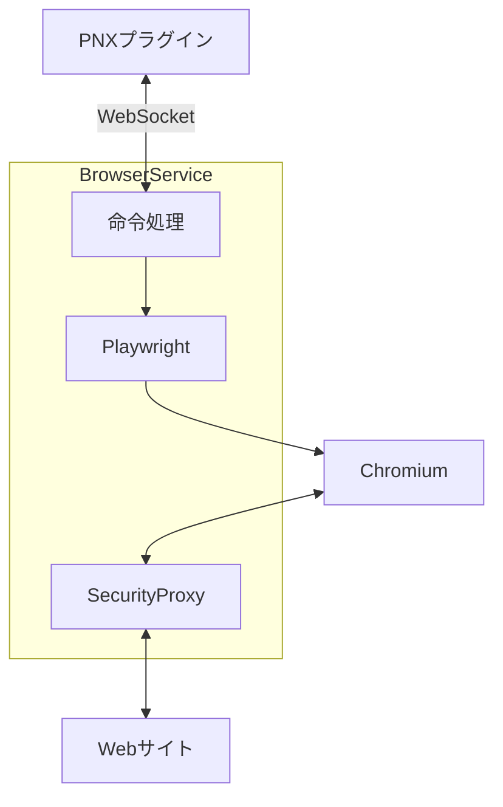
```mermaid
flowchart TD
    Plugin[PNXプラグイン]
    Chromium[Chromium]
    Web[Webサイト]

    subgraph Service[BrowserService]
        Control[命令処理]
        Playwright[Playwright]
        Proxy[SecurityProxy]
        Control --> Playwright
    end

    Plugin <-->|WebSocket| Control
    Playwright --> Chromium
    Chromium <--> Proxy
    Proxy <--> Web
```

これで、とりあえずWebページを表示する構図としては完成です。  

でもまだ構図だけで、考えるポイントは残っています。  

Chromiumが見ている画面を、どうやってPNXへ運ぶのか  
運んできた大きな画像を、どうやって小さい地図に出力するのか  
そして、操作の実装。 プレイヤーがWeb画面を映した額縁を殴った位置を特定し  
クリックさせる処理にしたい　等の最初の構想で決めた要件。  

ここから先は、この構図の矢印を1本ずつ実装していく作業です。  
大枠の要件でふんわりした内容から、一気に実用的なお話になります。  

楽しくなってきましたね。　ドパガキにはそろそろ限界かもしれんね。  

## Webページを画像にして伝達する

### BrowserServiceの仕事

まず作ったのが、`BrowserService` です。Node.js/TypeScriptで動かすことに。  
PNXの外側で待機して、WebSocket経由で届いた命令をPlaywrightへ渡します。  

外側で待機...というのは、  
PNXサーバーと同じPC上では動くけど、同じJavaプロセスには入れない、という意味です。  
つまり、PNXとは別で起動するアプリってところ。   

標準では `127.0.0.1:19150` だけでWebSocketを待ち受けます。  
インターネット上のどこかに中継サーバーを公開する構成ではなく、  
ローカルでPNXとBrowserServiceを分けて動かします。  

Webページ上のJavaScriptからlocalhostのWebSocketを勝手に操作されないよう、  
`Origin` headerを持つbrowser由来の接続も拒否します。  
必要ならBearer tokenを付け、PNXからの接続自体を認証できます。  

こういった処理をPNXプラグイン本体に導入してしまうと、  
CPUやメモリをそこそこ使うし、表示するWebページによっては処理が長引くこともあります。  
この辺をまとめて解決する手段の一つとして採用したのが「外側」を作ることです。  

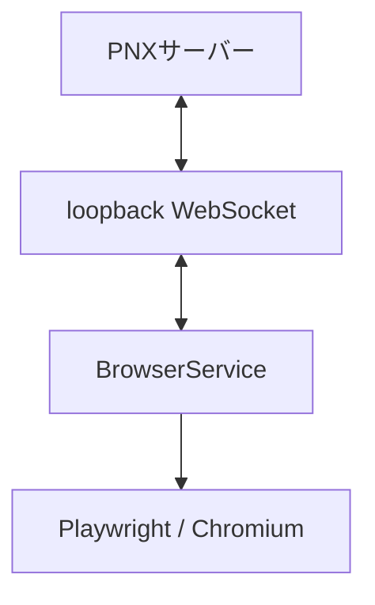
```mermaid
flowchart TD
    PNX[PNXサーバー]
    WS[loopback WebSocket]
    Service[BrowserService]
    Browser[Playwright / Chromium]

    PNX <--> WS <--> Service
    Service --> Browser
```

WebSocketを選んだのは、通信が一方通行ではないことに由来しています。  
PNXからは「このURLを開いて」「ここをクリックして」という命令を送り、  
BrowserServiceからは操作結果と新しいPNGが返ってくる想定。  
同じ接続でJSONとbinaryの両方を順番に扱えるので、今回の用途にちょうどよい。  

あと、これは結果論で副次的な話ですが、  
BrowserServiceが落ちても、PNXまで一緒に終了することはありません。  
標準5秒間隔で再接続し、接続が戻ったら必要なbrowser sessionを作り直します。  
同じPNX実行中なら、最後に開いていたURLももう一度navigateします。  

逆にWebSocketが切れた側のBrowserServiceでは、  
その接続が所有していたsessionを破棄します。  
誰も操作できないChromiumだけが、裏でずっと生き残るのを防ぐためです。  

### PNXからBrowserServiceへ命令を送る

BrowserServiceへ送る命令は、UTF-8のJSON形式のテキストです。  
たとえば4×3枚の地図で作る画面なら、最初にこんなrequestを送ります。  

```json
{
  "type": "session.create",
  "requestId": "8a5df69b-7f55-42b7-b728-fb979871fb9d",
  "sessionId": "main",
  "width": 512,
  "height": 384
}
```

`main` という名前で、512×384のブラウザを作ってね　という命令です。  
BrowserServiceはsessionごとに1つの `BrowserContext` と `Page` を作ります。  
地図12枚それぞれにブラウザを作るのではなく、12枚をまとめて1つのPageです。  

そのほかの命令も、意味がそのまま分かる名前にしました。  

- `browser.navigate`：URLを開く
- `browser.click`：指定した座標をクリック
- `browser.back` / `browser.forward`：戻る・進む
- `browser.reload`：再読み込み
- `browser.scroll`：スクロール(まだモックしか実装してない。したい！)

すべてのrequestには `requestId` を付けます。  
BrowserServiceからのresponseにも同じIDを付けて、  
PNX側で「どの命令に対する返事か」を判別します。  

操作を非同期に投げまくると、navigateより先にclickが実行されたりしかねません。  
そこで同じWebSocket上のrequestは、到着した順にqueueで処理します。  
queueへ積めるmessage数とbyte数にも上限を設け、  
処理できない量が来た場合は無限にメモリへ積まず接続を終了します。  

### Webページをスクリーンショットにする

命令を受けたBrowserServiceは、PlaywrightでChromiumを操作します。  
ページを開いたら、次は画面をPNXへ送れる形にしないといけません。  

ここで使うのが `page.screenshot`。  
コードの中心だけ抜き出すと、このような形です。  

```ts
const png = await session.page.screenshot({
  type: "png",
  fullPage: false,
  animations: "disabled",
  caret: "hide",
  scale: "css",
  timeout: screenshotTimeoutMs,
});
```

`fullPage: false` なので、Webページ全体を縦長に撮るのではなく、  
viewportに見えている範囲だけをPNGにします。  
PNX側が512×384なら、Chromium側も512×384。  
途中で画像を拡大縮小せず、1Web pixelと1画像pixelを合わせます。  
Webページがスマホのサイズに合わせてレイアウトを変えたり、画面幅に合わせたり...  
といった動きを呼び出せるってことです。  

animationは止め、入力caretも隠します。  
「caretが点滅しただけで画像が変わった」みたいな、  
マイクラ側にとって不要な更新を増やさないためです。  


ちなみに余談で、今回ffmpegは使っていません。  
画面を動画として録画しているのではなく、操作後に静止画を1枚撮る構成です。  
Playwrightが直接PNGを返してくれるので、ここへさらにffmpegを挟む必要はありませんでした。  

将来、高FPSで動画を流す、H.264等へencodeする、となれば出番があるかもしれません。  
ただし今回の目的は、リンクを押したあとの最新画面を地図へ出すこと。  
用途に対して構成を増やしすぎないようにしました。  

**ただ、動画を流す技術はすでに実績があり、やれる見込みはある！**

### PNGはJSONに詰めない

PNGをPNXへ送るときは、Base64文字列へ変換しません。  
WebSocket上で、次の2messageを連続して送ります。  

1. PNGの情報が入ったmetadata JSON
2. PNG本体のbinary message

metadataはこんな形です。  

```json
{
  "type": "browser.frame",
  "sessionId": "main",
  "frameId": 123,
  "format": "png",
  "width": 512,
  "height": 384,
  "length": 73412
}
```

PNXは、このJSONの直後に `length` byteのPNGが来ることを期待します。  
対応外のformat、0以下のサイズ、想定を超える大きさ、長さの不一致、  
metadataなしで突然届いたbinaryは、その場でprotocol errorにします。  

WebSocketの送信bufferが詰まっているときも、  
metadataだけ送ってPNGだけ捨てる、ということはしません。  
必ず2つまとめて送るか、1frame丸ごと捨てます。  
JSONと別のPNGが組み合わさる事故を防ぐためです。  

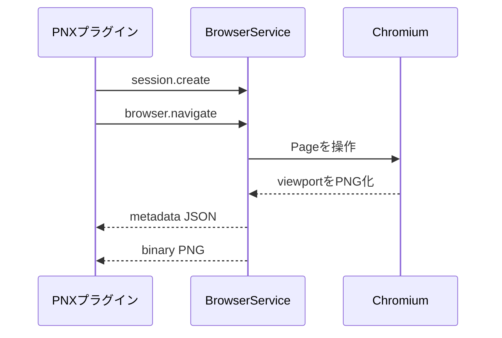
```mermaid
sequenceDiagram
    participant PNX as PNXプラグイン
    participant BS as BrowserService
    participant Page as Chromium

    PNX->>BS: session.create
    PNX->>BS: browser.navigate
    BS->>Page: Pageを操作
    Page-->>BS: viewportをPNG化
    BS-->>PNX: metadata JSON
    BS-->>PNX: binary PNG
```

これで、Chromiumが見ている画面をPNXへ運べました。  

次は、この大きな1枚をマイクラの地図へ入れていきます。  

## Web画面を地図へ表示する

### 地図1枚は128×128px

マイクラの地図1枚へ表示できる画像は128×128pxです。  
Chromiumから届いた512×384pxのPNGは、そのままでは1枚へ入りません。  

縮小して押し込む手もありますが、文字がつぶれてリンクも押しづらい。  
じゃあ地図を増やそう、という非常にマイクラらしい解決をします。  

横4枚・縦3枚なら、画面の大きさはこうなります。  

```text
width  = 4 × 128 = 512px
height = 3 × 128 = 384px
```

このとき、128×128の小さなブラウザを12個起動するわけではありません。  
BrowserServiceには512×384のPageが1つだけあり、  
PNXへ届いてから最後の段階で12枚へ切り分けます。  

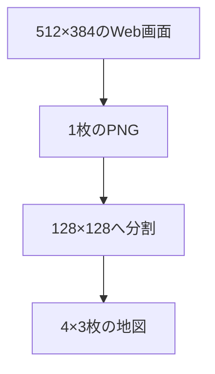
```mermaid
flowchart TD
    Page[512×384のWeb画面]
    PNG[1枚のPNG]
    Split[128×128へ分割]
    Maps[4×3枚の地図]

    Page --> PNG --> Split --> Maps
```

この形なら、地図の境界をまたぐ文字や画像も、元は同じ1枚の画面です。  
あとでクリックするときも、12枚をまとめた512×384の座標として扱えます。  

### 額縁をディスプレイとして登録する

画面を作るときは、同じ向きの空の額縁を並べ、  
正面から左上の額縁を見ながら次のコマンドを実行します。  
browser って親コマンドから子機能を生やすことにしました。  

```text
/browser create main 4 3
```

これで、見ている額縁を左上にした4×3枚の `main` ディスプレイを作ります。  
実際は、額縁の有無、向き、すでに別のディスプレイで使われていないか等、  
いくつかのバリデーションを先に行います。  
変な並びなら、途中まで地図を入れずに作成を中断します。  

各地図には、列、行、map ID、額縁のblock座標を持つ `MapTile` を割り当てます。  
地図item側の `map_uuid`、画像、額縁のmap state等も同じIDへそろえます。  

通常の額縁として触られて地図が回ったり落ちたりすると困るので、  
rotationは0、drop chanceも0に設定しています。  
ディスプレイの座標・向き・大きさ・map IDは `displays.json` へ保存し、  
PNXを再起動したときも同じ額縁へ同じmap IDを復元します。  

### 1枚のPNGを12枚へ分ける

PNGが届いたら、すぐ画像ライブラリへ丸投げするのではなく、  
Java側の `FrameRenderer` で先に中身を確認します。  

- PNG signatureとIHDRが正しいか
- width / heightがディスプレイと一致するか
- pixel数が上限内か
- PNG decoderが返した形式と大きさが正しいか

検査を通ったら、`MapTileRenderer#split` で128×128ずつ切り出します。  
実装の中心だけ抜き出すと、次の処理です。  

```java
graphics.drawImage(
    frame,
    0, 0, MapTile.SIZE, MapTile.SIZE,
    tile.imageStartX(),
    tile.imageStartY(),
    tile.imageStartX() + MapTile.SIZE,
    tile.imageStartY() + MapTile.SIZE,
    null
);
```

左上なら元PNGの `(0, 0)` から `(128, 128)`。  
その右なら `(128, 0)` から `(256, 128)`。  
列と行から切り出し位置を決めるので、12枚すべて同じ処理で作れます。  

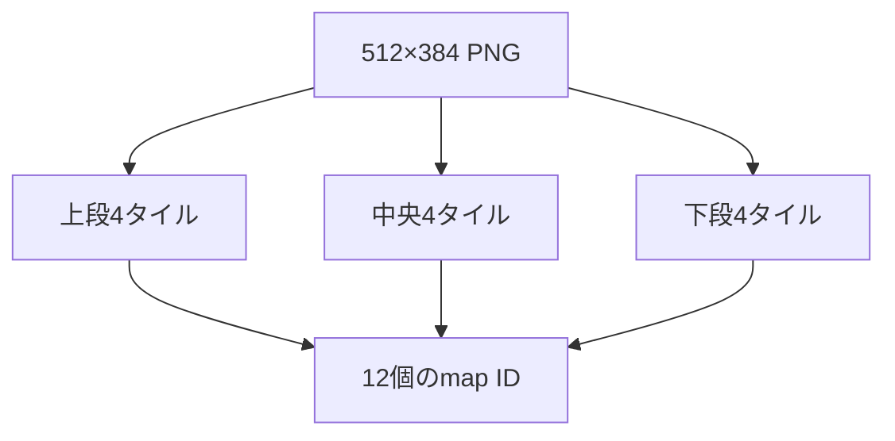
```mermaid
flowchart TD
    PNG[512×384 PNG]
    Top[上段4タイル]
    Middle[中央4タイル]
    Bottom[下段4タイル]
    IDs[12個のmap ID]

    PNG --> Top
    PNG --> Middle
    PNG --> Bottom
    Top --> IDs
    Middle --> IDs
    Bottom --> IDs
```

ちなみに、ここで画像を出せたのですが 色がおかしくなり1時間格闘しました。

Javaの `BufferedImage` から取得するpixelはARGBです。  
一方、今回のmap packetへ渡す並びはABGR。  

そのまま送ると、画像の形は合っているのに色だけがおかしくなります。  
全く動かんより、ほぼ動いている状態で動かないのが一番だるい。。。   
PNXの `Utils.toABGR` を使って変換します。  

```java
int argb = image.getRGB(x, y);
pixels.add((int) Utils.toABGR(argb));
```

変換後の16,384pixelを `ClientboundMapItemDataPacket` へ詰め、  
対象プレイヤーへ送ります。  

次は説明用に項目を省いたコードです。  
実際にはcreation map IDs、dimension、map origin、scale等も設定しています。  

```java
ClientboundMapItemDataPacket packet = new ClientboundMapItemDataPacket();
packet.setMapID(mapId);
packet.setWidth(128);
packet.setHeight(128);
packet.setPixels(tile.pixels());
player.sendPacketImmediately(packet);
```

これで12枚の地図が、1枚のWeb画面としてつながりました。  
よっしゃ、僕のGitHubページはできた。  

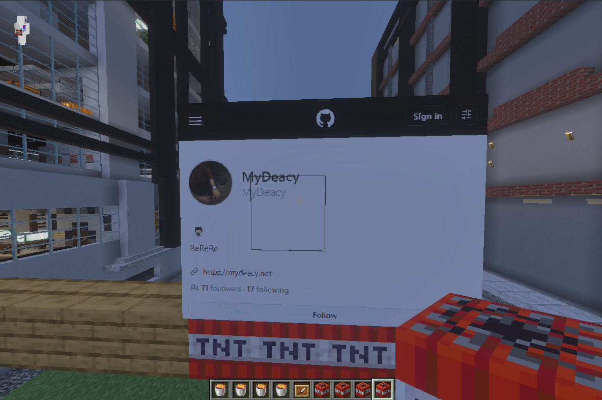

このスクショでは、もう少し広い8×5枚へ増やして表示しています。  

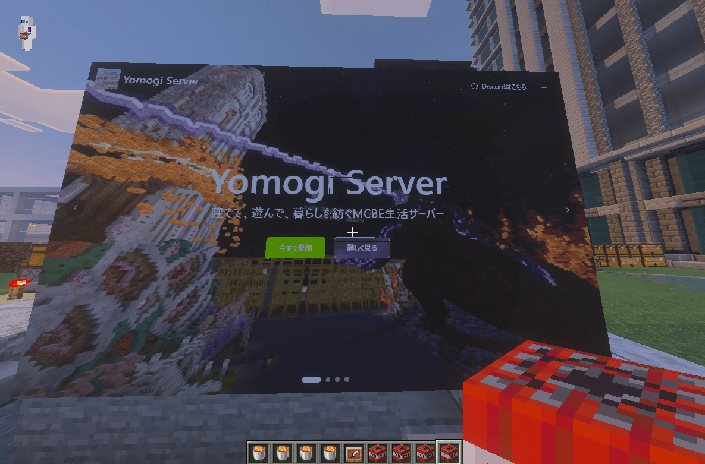

見た目だけなら、もうかなりブラウザです。 

でもリンクを押そうとして殴っているのは、Webページではなくマイクラの額縁。  
次は、ここを何とかします。  

## 額縁をクリックしてWebページを操作する

### マイクラのeventだけでは座標が足りない

Webブラウザへclickを渡すには、少なくとも次の情報が必要です。  

```json
{
  "type": "browser.click",
  "requestId": "uuid",
  "sessionId": "main",
  "x": 314,
  "y": 182,
  "button": "left"
}
```

512×384のviewport上で、どのpixelをどのbuttonで押したか。  
Playwrightが欲しいのは、この `(x, y)` です。  

一方、PNXのeventから最初に分かるのは  
「プレイヤーがこの額縁blockを左クリックした」という情報。  
押した地図が何列何行目かは分かっても、  
地図画像の何pixel目を狙ったかまでは、そのまま取得できません。  

最初は、額縁ごとに128pxを足していけば何とかなりそうにも見えます。  
ただ、地図の中の位置が取れないので、結局最後の1pixelまで決まりません。  

そこで、プレイヤーの視線を使うことにしました。  

### 視線とディスプレイがぶつかる場所を求める

プレイヤーの目から、見ている方向へまっすぐ線を伸ばす。  
その線とディスプレイ表面が交差した場所を、クリック位置にします。  

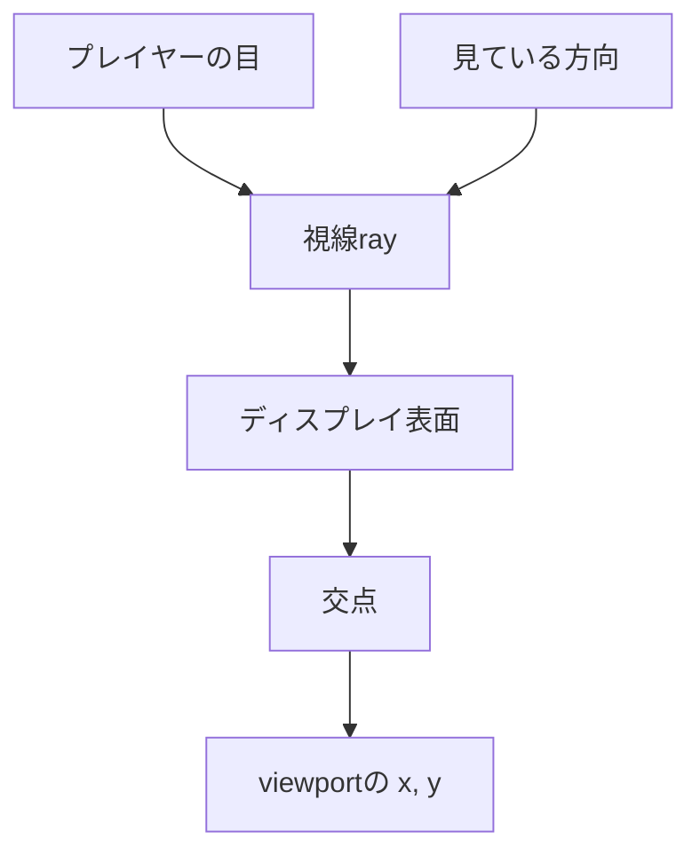
```mermaid
flowchart TD
    Eye[プレイヤーの目]
    Direction[見ている方向]
    Ray[視線ray]
    Plane[ディスプレイ表面]
    Hit[交点]
    Pixel[viewportの x, y]

    Eye --> Ray
    Direction --> Ray
    Ray --> Plane --> Hit --> Pixel
```

`InteractionManager` は `PlayerInteractEvent` を受け取り、  
登録済みディスプレイの `BlockFrame` なら通常操作をcancelします。  
`ItemFrameUseEvent` にも保護を入れて、  
clickのたびに地図が回る、外れる、別itemが入る、といった動きを止めます。  

そのあと、プレイヤーの目の位置と `Player#getDirectionVector` を  
`DisplayRaycaster#raycast` へ渡します。  

視線の始点を `e`、向きを `d`、ディスプレイ左上を `o`、  
ディスプレイ表面の法線を `n` とすると、交点までの距離 `t` は次の式です。  

```text
t = n・(o - e) / (n・d)
```

急に数学が出てきましたが、やっていることは  
「目から伸ばした線が、壁のどこへ刺さったか」を求めるだけです。  

- ディスプレイの背面から見ている
- 視線が表面とほぼ平行
- 交点が画面の外にある
- 標準6blockより遠い

このような場合はclickとして扱いません。  
裏側から額縁を殴ったら表のリンクが押せる っていうふざけた現象が起きたので  
しぶしぶ対策も兼ねてます。    

### 交点をWebのpixelへ変換する

交点が決まったら、ディスプレイの右方向へどれだけ進んだかを `u`、  
下方向へどれだけ進んだかを `v` として求めます。  

4×3画面なら、  

- 左端 `u=0`、右端 `u=4`
- 上端 `v=0`、下端 `v=3`

です。  
このblock単位の値を512×384へ比例変換すれば、  
Playwrightへ渡せるpixel座標になります。  

clamp処理を省いて中心だけ抜き出すと、次のコードです。  

```java
double u = local.dot(display.facing().right());
double v = local.dot(display.facing().down());

int x = (int) Math.floor(
    u / display.columns() * display.browserWidth()
);
int y = (int) Math.floor(
    v / display.rows() * display.browserHeight()
);
```

4×3画面の中央なら `u=2`、`v=1.5` なので、結果は約 `(256, 192)`。  
「中央がどの地図に所属するか」という特別な分岐を作らず、  
最初から12枚全体の座標として計算します。  

実装では画面の端が `width` や `height` そのものにならないよう、  
最後に `width - 1`、`height - 1` までへ丸めています。  

### 壁の向きで左右が逆になる

次に困るのが、ディスプレイの向き。  
北向きの画面で見た「右」と、南向きの画面で見た「右」は、  
world座標上では反対方向です。 東西向きではZ軸も関わります。  

そこで `DisplayFacing` に、NORTH / SOUTH / EAST / WESTそれぞれの  
`normal` と `right`、共通の `down` を持たせています。  

```java
NORTH(new Vec3d( 0, 0, -1), new Vec3d(-1, 0,  0)),
SOUTH(new Vec3d( 0, 0,  1), new Vec3d( 1, 0,  0)),
EAST (new Vec3d( 1, 0,  0), new Vec3d( 0, 0, -1)),
WEST (new Vec3d(-1, 0,  0), new Vec3d( 0, 0,  1));
```

向きごとのvectorだけ先に定義すれば、raycast本体は同じ式を使えます。  
NORTH用、SOUTH用...と座標計算を4回書かずに済みます。  

額縁表面はblockの中心そのものではない点も小さな罠。  
`BlockFrame` は厚さ1/16blockなので、ディスプレイ左上の原点は  
額縁の見えている面まで `7/16` block補正します。  
正面から中央だけを押すなら気づきにくいですが、斜めから四隅を狙うと効いてきます。  

### clickして、もう一度PNGを撮る

座標が決まったら、BrowserServiceへ `browser.click` を送ります。  
BrowserService側でもviewport内かを確認し、Playwrightへ渡します。  

```ts
await session.page.mouse.click(request.x, request.y, {
  button: request.button,
});
```

左clickと右clickはWeb側へそのまま渡します。  
Sneak中だけは座標clickではなく、  

- Sneak + 左click：戻る
- Sneak + 右click：進む

として扱います。  
また、Bedrock clientから短時間に同じ操作が重なって届いても  
二重clickにならないよう、プレイヤー・ディスプレイごとに標準75msのcooldownを入れました。  

click後は標準50ms待ち、最大2秒の範囲で `domcontentloaded` を待ってから  
新しいスクリーンショットを要求します。  
リンクで別ページへ移動した場合も、JavaScriptがその場で表示を書き換えた場合も、  
結果は新しいPNGとして同じ経路を戻ります。  

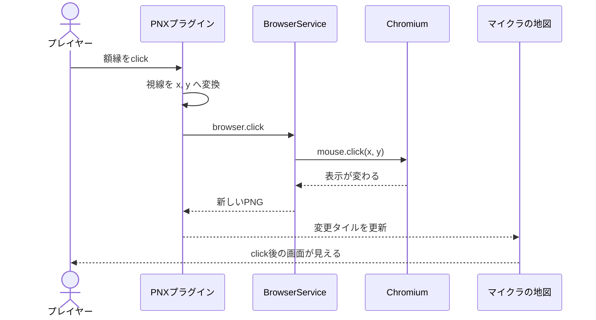
```mermaid
sequenceDiagram
    actor Player as プレイヤー
    participant PNX as PNXプラグイン
    participant BS as BrowserService
    participant Page as Chromium
    participant Map as マイクラの地図

    Player->>PNX: 額縁をclick
    PNX->>PNX: 視線を x, y へ変換
    PNX->>BS: browser.click
    BS->>Page: mouse.click(x, y)
    Page-->>BS: 表示が変わる
    BS-->>PNX: 新しいPNG
    PNX-->>Map: 変更タイルを更新
    Map-->>Player: click後の画面が見える
```

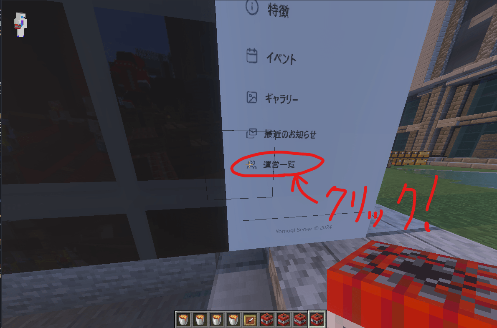

クリックすると画面が遷移する↓

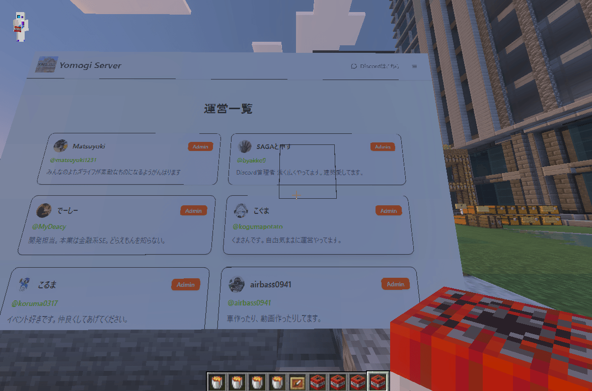

この仕組みで面白いのは、PNX側がWebページのリンクを知らないところです。  
`<a>` も `<button>` も、click eventのJavaScriptも知りません。  

PNXは座標だけを送り、そこに何があるかはChromiumが判断する。  
だからWebページごとにプラグインを書き換える必要もありません。  

ここまできて、ようやくデジタルサイネージではなく  
「実際に触れるブラウザ」になりました。  

## 動いたものを、実用できる形へ近づける

表示もclickもできたので、機能としては完成です。  

...と言いたいのですが、素直に全部処理すると少々重い。  
4×3画面なら、1回更新するたびにmap packetは最大12枚分です。  
ボタンの色が少し変わっただけでも、近くのプレイヤー全員へ12枚を送り直す。  
さらに操作が続けば、古いPNGが処理待ちに並びます。  

趣味で作ったものとはいえ、ここは手を入れてどうにかしたいところ！  

### 変わった地図だけ更新する

BrowserServiceからは、毎回512×384の完成したPNGが届きます。  
ただし、マイクラへ送る単位は128×128の地図。  

ならば、前回と同じタイルは送らなくてよい。  

`MapTileRenderer` は画像を分割するとき、各タイルのpixelからCRC32を計算します。  
`FrameCache` にある前回送信済みのhashと比べ、違ったタイルだけを更新対象にします。  

```java
CRC32 crc32 = new CRC32();

for (int argb : row) {
    crc32.update(argb >>> 24);
    crc32.update(argb >>> 16);
    crc32.update(argb >>> 8);
    crc32.update(argb);
    pixels.add((int) Utils.toABGR(argb));
}
```

たとえば右下のボタンだけ変わったなら、  
基本的にはそのボタンがある地図1枚だけhashが変わります。  
BrowserServiceは地図の境界を知らず、PNXも何のbuttonかを知らない。  
それでも画像の比較だけで、送信を12枚から1枚へ減らせます。  

### 「最新画像」と「送信済み画像」を分ける

差分更新で注意するのが、比較元のcacheをいつ更新するかです。  

画像を分割できた時点でcacheを進めてしまい、  
そのあとのpacket送信で失敗したとします。  
するとPNX側は送信済みだと思っているのに、プレイヤーの画面は古いまま。  
次回も「前回と同じ」と判断され、必要なタイルが送られなくなります。  

そこで、`FrameCache` の更新は二段階です。  

1. `prepareUpdate` で差分候補を作る
2. packet送信後に `commit` して比較元を進める

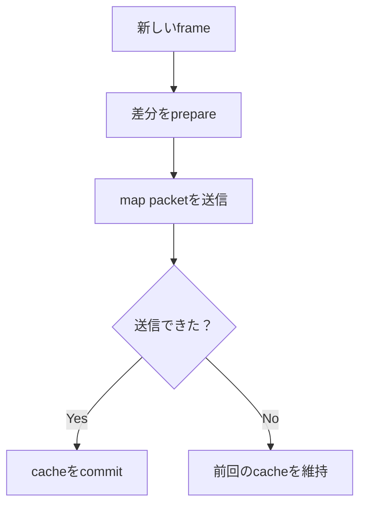
```mermaid
flowchart TD
    Frame[新しいframe]
    Prepare[差分をprepare]
    Send[map packetを送信]
    Result{送信できた？}
    Commit[cacheをcommit]
    Keep[前回のcacheを維持]

    Frame --> Prepare --> Send --> Result
    Result -->|Yes| Commit
    Result -->|No| Keep
```

画像を作れたことと、プレイヤーへ送り終えたことは別。  
ちょっとだけ面倒ですが、この区別で画面の一部だけ古く残る事故を防ぎます。  

### 古い画面を全部再生しない

もう一つ、非同期処理ならではの問題があります。  

画面AからBへ移動し、さらにすぐCへ移動。  
Aの画像処理中にBとCが届いた場合、Bを一度描いてからCへ進む必要はありません。  
今ほしいのはCです。  

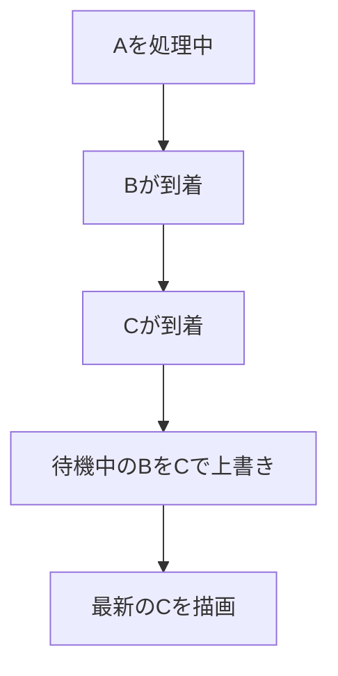
```mermaid
flowchart TD
    A[Aを処理中]
    B[Bが到着]
    C[Cが到着]
    Replace[待機中のBをCで上書き]
    Latest[最新のCを描画]

    A --> B --> C --> Replace --> Latest
```

BrowserServiceの `ScreenshotService` は、連続する撮影要求を標準75msでdebounceします。  
新しい操作が来れば古い撮影予定を無効化し、最後の状態だけを撮ります。  

PNX側の `BrowserFrameCoordinator` も、ディスプレイごとに小さなmailboxを持ちます。  
未処理画像は最大1つ、scheduler送信待ちも最大1つ。  
さらに新しいframeが来たら、まだ処理していない古いframeを置き換えます。  

今回作っているのは動画playerではありません。  
途中の全frameを再生するより、現在の画面へ早く追いつくことを優先しました。  

同じdisplay IDを削除して作り直した場合もあるため、sequenceだけでなくgenerationも持ちます。  
削除前の `main` から遅れて届いたPNGを、作り直した新しい `main` へ表示しないためです。  

### 重い処理はPNXの外で

512×384なら約20万pixel。  
PNGをdecodeして、12枚へ分けて、ABGRへ変換して、CRC32を計算する。  
これをPNXのゲーム処理と同じthreadへ載せると、画像更新がそのままカクつきにつながります。  

処理は次のように分けました。  

- WebSocket処理：2本のnetwork executor
- PNG decodeと画像分割：2〜4本のimage executor
- `displays.json` の保存：1本のstorage executor
- Playerへのpacket送信：PNX schedulerへ戻す

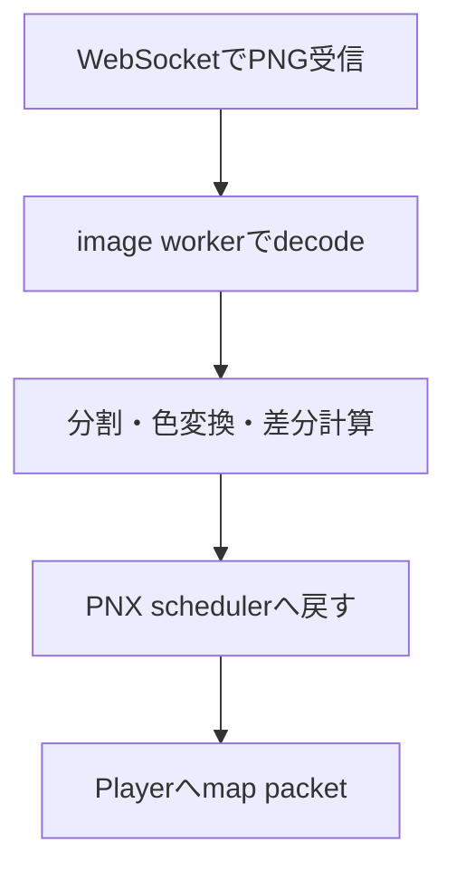
```mermaid
flowchart TD
    Receive[WebSocketでPNG受信]
    Decode[image workerでdecode]
    Split[分割・色変換・差分計算]
    Scheduler[PNX schedulerへ戻す]
    Packet[Playerへmap packet]

    Receive --> Decode --> Split --> Scheduler --> Packet
```

重い画像処理はゲームthreadの外。  
でも、worker threadから直接 `Player` を触らず、  
PNXの状態へ触る直前にschedulerへ戻します。  

なお、このMVPは `level-settings.levelThread: true` には対応していません。  
有効な環境で何となく動かすのではなく、起動時に理由を表示してpluginを無効化します。  

### 後から画面へ近づいたプレイヤー

差分更新は、前の画像を持っているプレイヤーには有効です。  
では、今まさに建物へ入ってきた人は？  

その人は差分の元画像を持っていません。  
変更された地図1枚だけ送っても、残り11枚は空か古い画像のままです。  

そこで、同じLevelかつ標準32block以内のプレイヤーをviewerとして管理します。  
1秒ごとに確認し、新しく範囲へ入った人へは差分ではなく最新の全タイルを送ります。  

さらにBedrock clientは、joinや再描画のタイミングで  
`MapInfoRequestPacket` を使って地図情報を再要求することがあります。  
その場合も `MapRequestListener` が `FrameCache` から最新画像を返します。  
額縁へ最初に入れた古い画像へ巻き戻らないための処理です。  

同じプレイヤー・map IDからの再要求は250msに1回まで。  
通常更新、新しく近づいた人、clientからの再要求。  
3つとも同じ `FrameCache` を正しい画面として使います。  

## 実際に動かしてみる

### pluginとBrowserServiceをbuildする

plugin側はJava 21を使います。  

```powershell
cd plugin
.\gradlew.bat clean test jar
```

生成されるjarは次の場所です。  

```text
plugin/build/libs/PNXBrowser-0.1.0.jar
```

これをPNXサーバーの `plugins/` へ入れます。  

BrowserServiceはNode.js 20.11以降と、Playwright用Chromiumが必要です。  

```powershell
cd browser-service
npm ci
npx playwright install chromium
npm run build
npm start
```

標準では `ws://127.0.0.1:19150` で待機します。  
PNX側も同じ接続先を使うので、同じPCなら最初は設定変更なしで接続できます。  

同じhost上の別processからの接続にも認証を付けたい場合は、  
BrowserServiceの `PNX_BROWSER_AUTH_TOKEN` と、  
plugin側の `browser-service.auth-token` に同じtokenを設定できます。  


### 額縁を並べてWebページを開く

準備ができたら、マイクラ内で次の順に操作します。  

1. 同じ向きの空の額縁を、横8列・縦5行に並べる
2. 正面から左上の額縁を見る
3. ディスプレイを作る
4. URLを開く

阿部寛のホームページは、冒頭の例によって権利が怖いので  
しんでしまったPMMPのホームページにしよう笑  
```text
/browser create main 8 5
/browser open main https://pmmp.io/
```

`create` が成功すると、40枚の額縁へ固有のmap IDが入り、  
`main` という1つのディスプレイとして `displays.json` へ保存されます。  

`open` を実行するとBrowserServiceがページを読み込み、  
PNGがPNXへ届き、40枚の地図へ分割されて表示されます。  

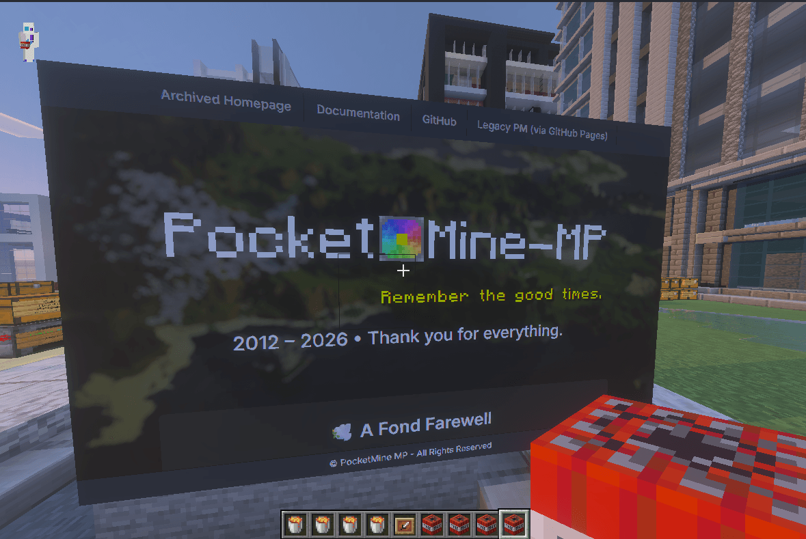

あとはリンクへ視線を合わせて左click。  

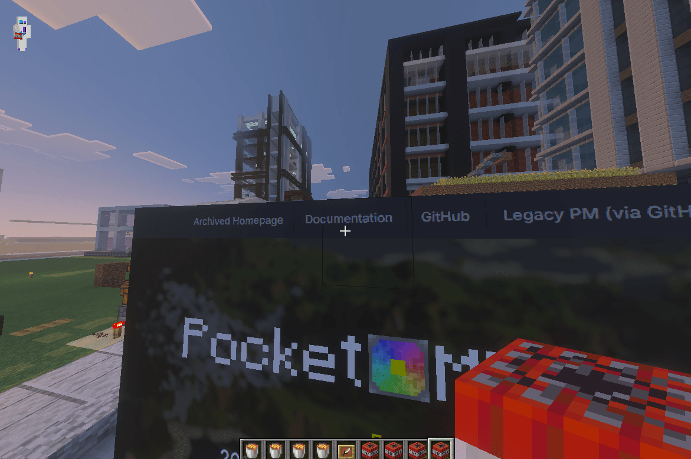

マイクラでは額縁を殴ったのに、Webページ側のリンクが普通に開きます。  

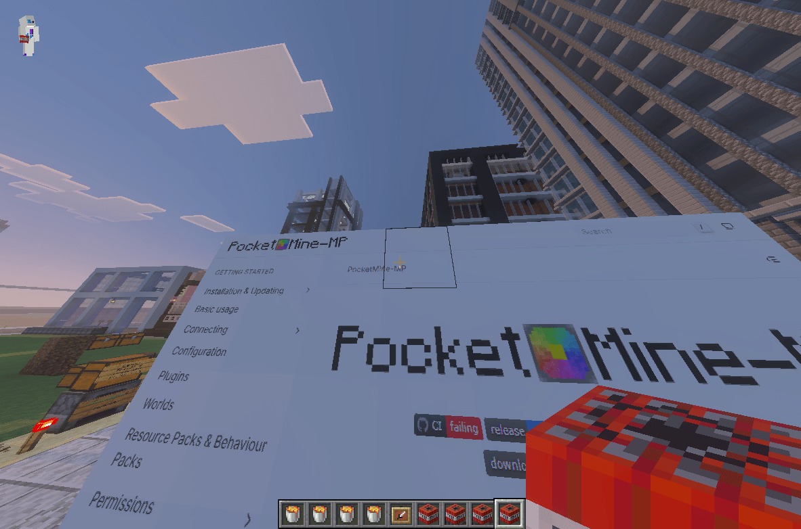

操作は次のとおりです。  

- 左click：Webページを左click
- 右click：Webページを右click
- Sneak + 左click：戻る
- Sneak + 右click：進む
- `/browser scroll <display> <deltaY> [deltaX]`：コマンドからスクロール

ページ内の画面が切り替わるリンクも、問題なく動く。  

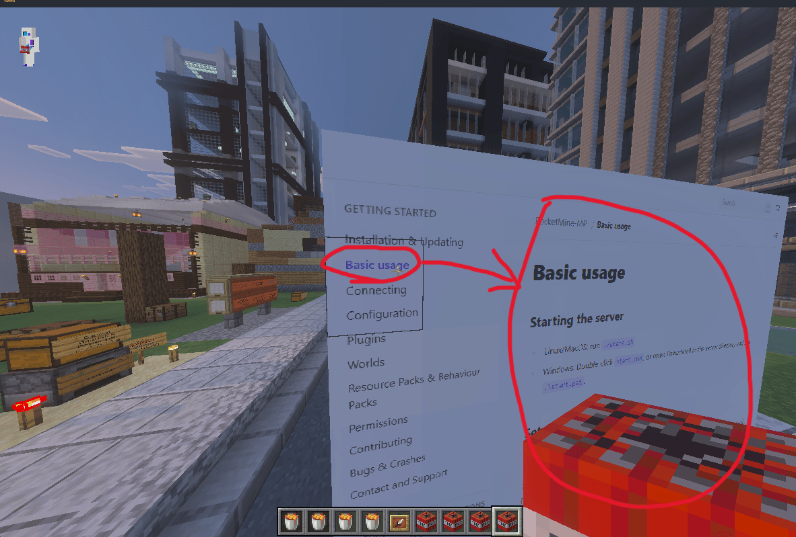

まぁ、一旦出来は良いか！！！！  
 

## 現在の制限

ここまで読むと、マイクラの中にChromeが丸ごと入ったように見えるかもしれません。  
しかし今回作ったものは、静的・低頻度更新のWebページ向けMVPです。  
普通のdesktop browserを、そのまま置き換えるものではありません。  

一番大きい違いは、画面を動画としてstreamingしていないことです。  
screenshotを撮るのは、create、navigate、click、back、forward、reload、  
scroll、許可されたpopup遷移等の操作後です。  
何も操作していない間に動くanimationや動画を、連続更新する仕組みではありません。  

現時点では、次の制限があります。  

- 完全なスクロール機能は未対応
- 音声、WebRTC、DRM、高FPS動画転送には未対応
- マイクラ内の完全なkeyboard UIや文字入力は未対応
- downloadは常にcancel、file uploadも未対応
- multi-tabにはせず、popupは閉じてmain Pageへ集約
- プレイヤーから送れるmouse buttonは左と右のみ
- 額縁は 東西南北の壁面のみ。床・天井は未対応
- PNXとBrowserServiceのWebSocketは数値loopbackアドレスだけ 

SecurityProxyも、標準ではprivate networkへのWebアクセスを拒否します。  
LAN内ページをどうしても表示したい場合は  
`PNX_BROWSER_ALLOW_PRIVATE_NETWORK=true` で許可できますが、  
SSRF防御を弱める設定なので、これもシステム・ユーザの責任境界が難しいところ...

## 今後やってみたいこと

まず欲しいのは、文字入力。  
リンクは押せるのに、検索欄を前にした瞬間できることがなくなります。  
マイクラのチャットやFormから、focus中のinputへ文字を送ることができれば、  
操作できるWebページの幅はかなり広がりそうです。  

ただし、文字を送るだけでも考えることがあります。  

- 誰が入力権を持つのか
- password欄の内容をchatへ出してよいのか
- 日本語入力をどう扱うのか
- 複数人が同時に操作した場合はどうするのか

次に、DOMの変化を見て必要なときだけ自動で撮影する仕組み。  
高FPS動画を目指すのではなく、statusや案内板の内容が変わったときだけ  
低頻度で更新する方向なら、マイクラの地図と相性がよさそうです。  

最後に開いたURLの永続化、権限管理、額縁への操作だけで完結するスクロール操作、  
tile内の変更領域まで考えた更新等、MVPの先に試せることはまだあります。  

ただ、前項の「現在の制限」含め、実装できる見込みは立っているので  
今後もっといい感じのモノができたら、Discord等のコミュニティ内で共有しようかなと思ってます！  

## おわりに

始まりはざっくりとした構想から、、、   
1つずつ足していった結果、  

- BrowserServiceとPNXをつなぐWebSocket
- Chromiumを守るSecurityProxy
- PNGを複数枚の地図へ分ける画像処理
- ARGBからABGRへの変換
- 視線と平面を使ったclick座標
- 古いframeを捨てる非同期処理
- CRC32を使ったtile差分
- Bedrock clientからのmap再要求

等、色々手を伸ばしてました。  

あと、この過程で感じたのは、AIの力。  
普段は、AIに頼って自分の頭で把握してない事態が起こるのが嫌いで  
AIは補助ツールぐらいのレベルで使用してるのですが、  
今回は半バイブコーディング的な使い方をしてみました。  

昔書いたコードをベースに新規作成(※)したのですが、結果的に全体の7割はAIが書いたと思う。   
※正確には、Nukkit→PowerNukkitX用に変換  

最初の構想のような要件定義チックな時点では、かなりAIの力不足を感じましたが  
要件が決まってからは、実現する力が半端じゃなかった。  
あと勝手にテストしてくれるの何なんだ。すごいな。  

マイクラの地図は、ただのアイテムでありながら  
任意のpixelを表示できる小さなディスプレイでもあります。  
1枚で小さければ並べる。  
表示だけで物足りなければ、視線を入力として返す。  

阿部寛のホームページを表示するだけだったはずの壁は、  
リンクを押して次へ進めるブラウザになりました。

めでたしめでたし。  

** みんなもマイクラ内で動くブラウザづくり チャレンジしてみてね！ **  
　

