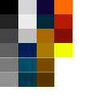
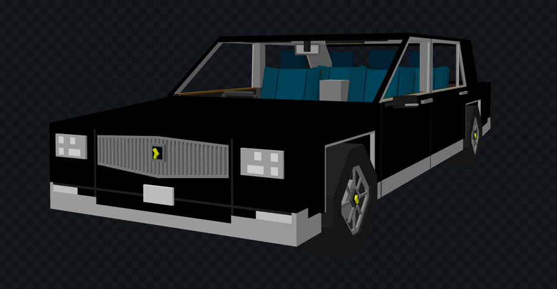
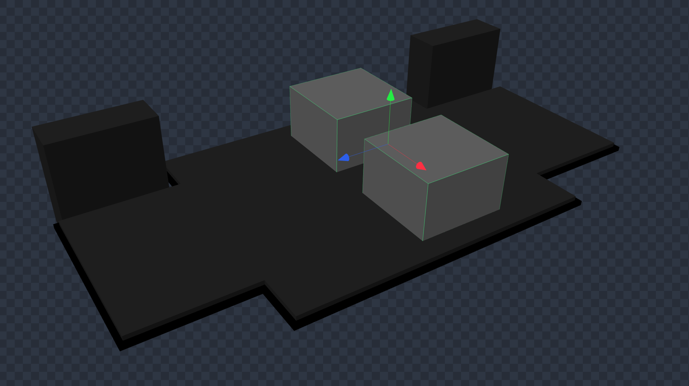
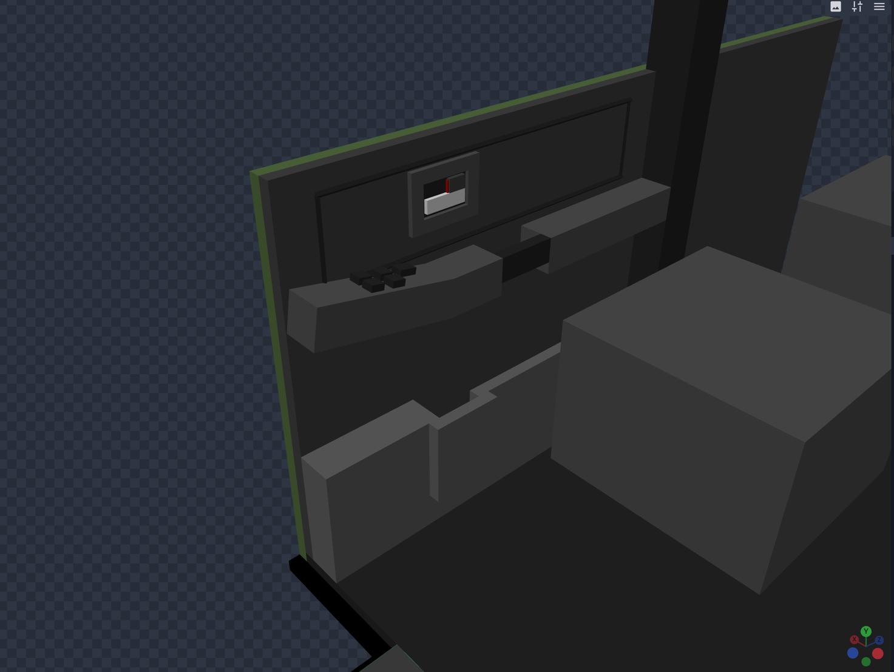
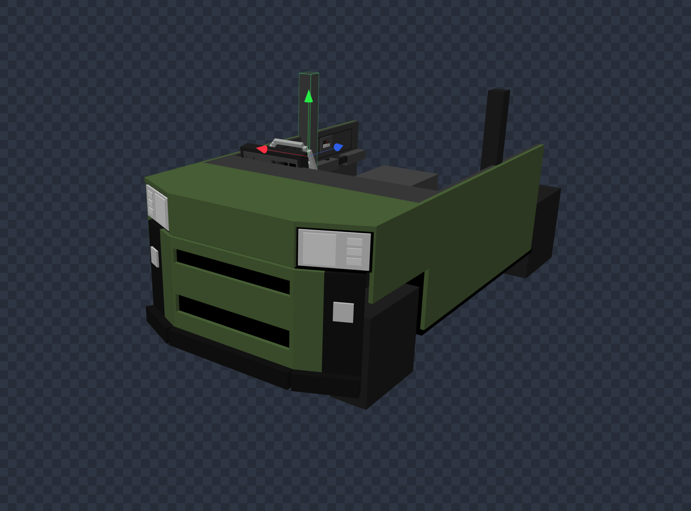

こんにちは。  
みなさんいかがお過ごしでしょうか？  
車の制作を行なっているBassです。

このブログが公開されている頃はきっと暑い日々が続いていると思います。  
なぜこのようなことを言うのかというと、この文章を書いているのは４月だからです。

では、数ヶ月かけて何を書くのかというと「よもぎサーバーの車ができるまで」についてです。

ご存知の方も多いと思いますが、よもぎサーバーには車という目玉要素がありますね。  
その車たちは全てよもぎサーバーのために作成しており、ほかのサーバー運営メンバーからも「車ができるまでをブログにしたらいいのに」と言われたことがありました。

今回は新しく発表された車たちがどのようにして作られたのかを長々と書いていきます。

一言申し上げておくと、私の車制作は完全独学です。  
ソフトの便利な使い方や正しい使い方をしていない可能性が非常に高いので、操作方法などは真似をしないことをお勧めします。

※制作を進めながら書いている都合上、実際に発表しているのに内容が予定などを表す言葉になっていることがあります。

<!-- truncate -->

## 目次

- どんな車をつくるのか
- 色作り
- 制作（骨格）
- 制作（内外装）
- さいごに

## 「どんな車をつくるのか」

まず車作りを始めるにあたって、どんな車をつくるのかを決めていきます。  
大衆車にするのか、高級車にするのか、コンパクトカーにするのか、形は何がいいのかなどなど。  
そして何より、高額な買い物なのでお客様に楽しんでいただけるかを考えます。  
今回は今ある４輪車の一部（CALLUNA、TANGERIN）に新型車を投入します。  
ただ置き換えるというだけでなく、一部のラインナップにはさらに新型車を追加するので、かなり大変な作業になる予定です。

一例としてセダンタイプをご紹介します。  
CALLUNAはサーバーで一番ベーシックな車ですが、良くも悪くも面白さがありません。  
というわけで、現実世界にある車をモデルに４つのタイプを考えました。  
今回参考にしたのが、PRIUS、CROWN Sedan、LEXUS LC、カローラコンセプト車です。  
これだけでも、街中でよく見る車から高級車まで、セダンというのは実に幅が広いということがわかります。  
この４つの中から実際でサーバーで買っていただけるように絞り込みをしていきます。

まずはベーシックな車としてCROWN Sedanをモデルとした車。（CROWNは現実世界だと十分高級ですが、今のサーバー参加者たちの所得だとそもそも車は高級なのでCROWNをベースにします）  
走りを楽しみたい人へ贈るスポーツカーとしてPRIUSの要素を取り入れた車とそれのオープンカータイプです。

このような感じでほかのラインナップについても検討を進めていきます。

そしてつくる事に決めたのが以下の車たちです。

- TANGERIN 26
- CALLUNA 26
- CALLUNA 26 SPORTS
- CALLUNA 26 SPORTS Convertible

新たな車の名前はつけずに、前からサーバーにいる人、新しく入った人誰もが直感的にわかりやすい名前にしました。26とついているのは、2026年に発表されたモデルだからです。

## 「色作り」

車のソフトを立ち上げる前に色作りをします。  
色の種類が多いとそのぶん表現の幅が広がるのでなるべく多く設定します。

例えばCYPRESSでは２３色を用意していています。そのうち１０色が白から黒色までを段階的に表した灰色になっており、この段階が多ければ多いほど特に車内での装飾の自由度が高くなります。  
実はマイクラ内で車を出した時に床の灰色Aという色を座席にも使ってしまうと、影がないせいで全く立体感のない同一のブロックに見えてしまうんです。  
それを防ぐためにも灰色は多めに準備しています。

## 「制作（骨格）」

下準備は整ったのでBlockBenchというソフトを使って実際に車を製作していきます。  
（写真はTANGERIN26を製作している時のものです）  
床は主に客席がある中央を広く、タイヤがくる前後を狭く作り、大体の車の大きさが決まります。  
車というのはもちろん乗るためのものなので座席の大きさ、位置もこの時点で大体決めておきます。

ここで側面の内装もある程度作り込んでいきます。  
ドアレバーやスイッチ類などは細かく、フロントなどが出来上がると作業しにくいので座席の装飾以外はこの時点で完成させていきます。  
特に内装を作る時の注意点がブロックの大きさを１未満にしないことです。  
１未満にしてしまうとマインクラフトでは正しく描画されないので、画像にあるような細い線を入れる場合はブロックを４５度に傾けて入れるなど工夫が必要です。  
（この問題があるので、最初にBlockBenchでスケール？を設定するときは3000×3000にしています。あとで自由に大きさ変更できるので好みでOKです）

## 「制作（内外装）」

ある程度内装が仕上がったらいよいよ外装を作っていきます。  
私の場合は車の印象を左右するフロントから作りますが、これは気合というか、どこまでこだわれるかだと思っています。  
現実世界で見るような滑らかなラインを作ろうと思うと、四角いブロックではかなり作るのが大変になります。  
画像のTANGERIN 26は一番安い車なので、フロントの造形もほどほどに作ってあります。

さて、フロントができたらあとはこっちのもんです！  
リアや天井と外壁をくっつけて、シートを作ったらあっという間に車の完成です！

あ、一つアドバイスとしてあるのが、細かいところ、私の場合は特にリアで多いのですが、どうしてもシートとタイヤ付近などが干渉してしまうことがあり、どうすればいいのかわからなくなるときがあります。  
そんなときは黒一色にして、ブロックの凹凸が目立たないようにするといいですよ。

## 「さいごに」

最後の方はウヤウヤっとなってしまい、結局どう作るんだよというツッコミも聞こえてきますが、床とフロント、側面ができたらあとは現実の車を真似したりして根気強く頑張っていくしかありません。  
あと、私の場合は再現していて「うーん」というところがあれば、実写に乗りに行くこともありました。（CALLUNA26を作るにあたってプリウスに実際に乗ってきました）  
今はカーシェアで色々な車が借りられるのでおすすめですよ。

じゃ！
