# 2026年8月の人狼アンケートの結果について

よもぎサーバーでは2026年8月にマイクラ人狼イベントについてのアンケートを実施しました。  
集まった回答は6件でした。ご回答いただきました方、どうもありがとうございました。
本ブログでは、アンケートのうち選択式のものについて結果概要を公開し、また結果に基づく今後の運用方針についてお知らせします。  
なお、記述式の設問、および要望についても全て拝見しております。個人の特定につながる可能性があるためこの場での回答は差し控えますが、引き続きイベント運営の上で参考にさせていただきます。

(本ブログの執筆にAIは使用していません)

<!-- truncate -->

## 人狼イベントの参加目的

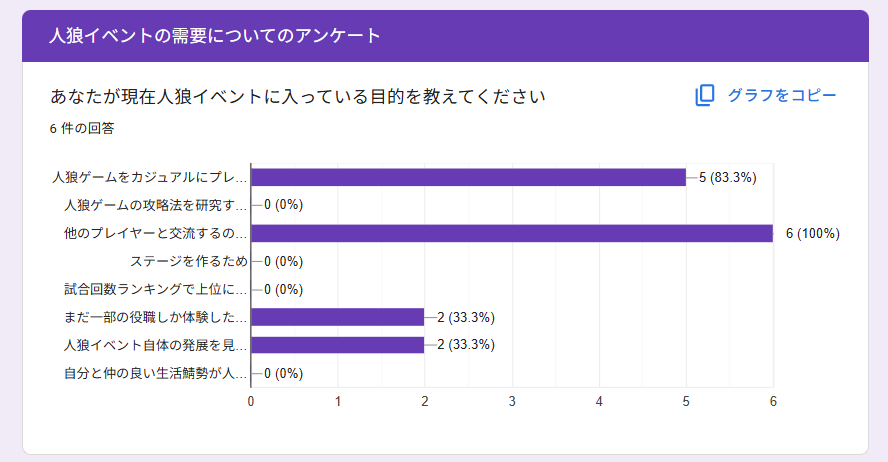

### 設問

あなたが現在人狼イベントに入っている目的を教えてください(複数回答可)

### 回答

 - 他のプレイヤーと交流するのが楽しいから(6件)
 - 人狼ゲームをカジュアルにプレイすることが楽しいから(5件)
 - まだ一部の役職しか体験したことがなく、すべての役職を体験したいため(2件)
 - 人狼イベント自体の発展を見届けたいため/人狼の発展に寄与したいため(2件)

### その他の選択肢
 
 - 人狼ゲームの攻略法を研究することが楽しいから(0件)
 - ステージを作るため(0件)
 - 試合回数ランキングで上位に位置するため(0件)
 - 自分と仲の良い生活鯖勢が人狼イベントにも参加しており、両方に参加しないと話についていけなくなるため(0件)

### 分析

 - 現在の人狼イベントでは唯一解を見つける攻略より緩やかな交流が重視されているようです
 - 主催者の主観では、殺伐とした試合に対する需要は現在でも少なからず存在するものの、数年前と比べて薄れているように感じます

### 運営方針

この結果を踏まえて現状の運営方針を変更する予定はありません。今後の要素追加の際に戦闘要素よりも交流要素を重視する可能性はあります。

## Basic配役の不平等性

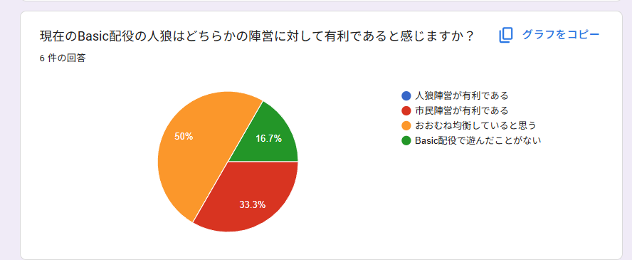

### 設問

現在のBasic配役の人狼はどちらかの陣営に対して有利であると感じますか？

### 回答

 - おおむね均衡していると思う(3件)
 - 市民陣営が有利である(2件)
 - Basic配役で遊んだことがない(1件)

### その他の選択肢

 - 人狼陣営が有利である(0件)

### 分析

 - 均衡か、やや市民有利なようです。無実の人が固定で入っていることが影響している可能性があります。

### 運営方針

Basic配役の「探偵」を「騎士」に、「殺し屋」を「殺人鬼」に変更することにより調整を行います。「無実の人」は試合進行上重要な役割を果たすことが多いため継続して採用します。

## Advanced配役の不平等性

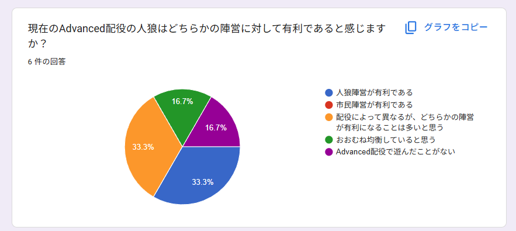

### 設問

現在のAdvanced配役の人狼はどちらかの陣営に対して有利であると感じますか？

### 回答

- 人狼陣営が有利である(2件)
- 配役によって異なるが、どちらかの陣営が有利になることは多いと思う(2件)
- おおむね均衡していると思う(1件)
- Advanced配役で遊んだことがない(1件)

### その他の選択肢

- 市民陣営が有利である(0件)

### 分析

- やや人狼有利なようですが、配役結果によって差があるようです。
- Advanced人狼は一部の固定役職を除き完全ランダムで役職が決まります。このため、現在のアルゴリズムでは強さに差が生じる可能性があります。

### 運営方針

現行の運営方針を継続します。即時で行うことのできる対策として人数比を調節させることがありますが、人数比に関しては参加人数-第三陣営の人数-第四陣営の人数をnとしたときに
市民陣営の数をceil((n+1)/2)、人狼陣営の数をfloor((n-1)/2)とすることが最も平等となることが過去の調整から明らかになっているため、現在の人数比を変更する予定はありません。  
また、役職の多様性を維持するため、役職抽選のアルゴリズムを変更することも考えていません。  
今後の役職追加の際に市民陣営を相対的に強化したり、現在の市民陣営のいずれかの役職を強化させる可能性はあります。  
また、将来的に投票により任意で役職を再抽選させる機能を追加する可能性があります。  

## 生活サーバーに対する誘導

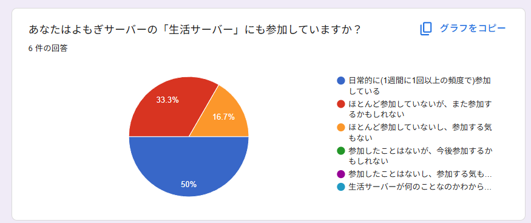

### 設問

あなたはよもぎサーバーの「生活サーバー」にも参加していますか？

### 回答

- 日常的に(1週間に1回以上の頻度で)参加している(2件)
- ほとんど参加していないが、また参加するかもしれない(2件)
- ほとんど参加していないし、参加する気もない(1件)

### その他の選択肢

- 参加したことはないが、今後参加するかもしれない(0件)
- 参加したことはないし、参加する気もない(0件)
- 生活サーバーが何のことなのかわからない(0件)

### 分析

- 回答者の全員が生活サーバーへの参加履歴がありました。
- 回答者のうち約半数は日常的に生活サーバーにも参加しているようです。

### 運営方針

この結果を踏まえて現状の運営方針を変更する予定はありません。生活サーバーの存在を知らない人が多数存在するようであれば改善の余地はありますが、結果を見るに
互いのサービスに対する認知は一定存在することが認められるため、 これ以上の対策は必要ないと考えます。
参加履歴があるうえで参加しないのは個人の好み、もしくは他方のサーバーの魅力が低いことが原因であるため、こちらも問題視していません。

## ルールの把握方法

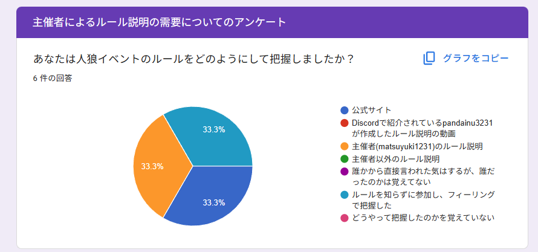

### 設問

あなたは人狼イベントのルールをどのようにして把握しましたか？

### 回答

- 公式サイト(2件)
- 主催者(matsuyuki1231)のルール説明(2件)
- ルールを知らずに参加し、フィーリングで把握した(2件)

### その他の選択肢

- Discordで紹介されているpandainu3231が作成したルール説明の動画(0件)
- 主催者以外のルール説明(0件)
- 誰かから直接言われた気はするが、誰だったのかは覚えてない(0件)
- どうやって把握したのかを覚えていない(0件)

### 分析

- 通常の参加フローで経由することが多い公式サイト・主催者の説明が多数を占めました
- ルールを知らずに参加して、フィーリングで把握した層が無視できません

### 運営方針

マイクラ人狼では円滑な試合進行の為、全ての方に参加前にルールを把握いただいているようにしています。  
ルールを知らずに参加できる導線を可能な限りなくせるよう、引き続きルール理解に対する広報を推進します。

## ルールの把握方法

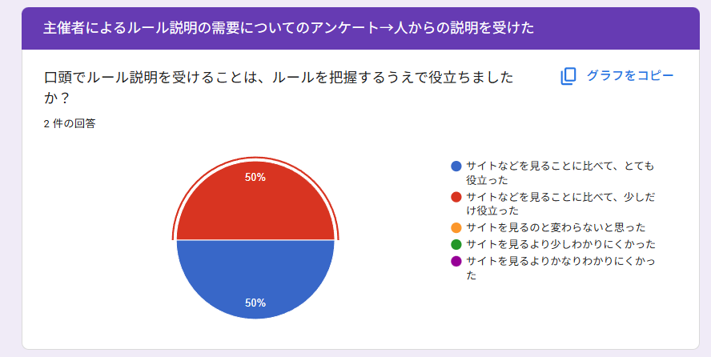

### 設問

口頭でルール説明を受けることは、ルールを把握するうえで役立ちましたか？

### 回答

- サイトなどを見ることに比べて、とても役立った(1件)
- サイトなどを見ることに比べて、少しだけ役立った(1件)

### その他の選択肢

- サイトを見るのと変わらないと思った(0件)
- サイトを見るより少しわかりにくかった(0件)
- サイトを見るよりかなりわかりにくかった(0件)

### 備考

1つ上の「ルールの把握方法」で「主催者のルール説明」を選んだ人のみを対象にした設問です

### 分析

- 忖度が発生している可能性は0ではありませんが、ありがたいことに高評価をいただいています

### 運営方針

引き続き人によるルール説明を継続します。

## ルール説明の改善点

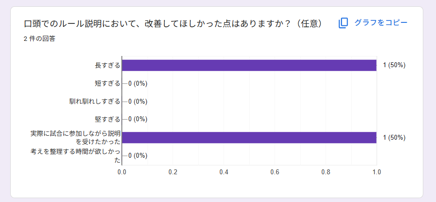

### 設問

口頭でのルール説明において、改善してほしかった点はありますか？（任意）

### 回答

- 長すぎる(1件)
- 実際に試合に参加しながら説明を受けたかった(1件)

### その他の選択肢

- 短すぎる(0件)
- 馴れ馴れしすぎる(0件)
- 堅すぎる(0件)
- 考えを整理する時間が欲しかった(0件)

### 備考

1つ上の「ルールの把握方法」で「主催者のルール説明」を選んだ人のみを対象にした設問です

### 運営方針

現在の人狼はルールが複雑であるため、ルール説明にはどうしても時間がかかってしまいます。引き続き参加誘導の効率化等によるルール説明の時短につとめます。  
また、「実際に試合に参加しながら説明を受けたかった」との回答を踏まえ、9月26日開催の人狼ではルール説明時にVCミュートを無効化した試合を運用し、実際のゲームを活用したルール説明を行いました。  
こちらの方法はインタラクティブな説明ができる一方、既存参加者の時間を奪ってしまうというデメリットもあります。  
引き続き最適なルール説明の方法を模索します。

## 試合中の雑談の許容性

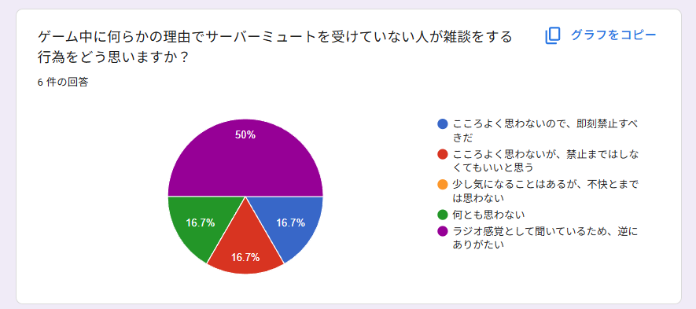

### 設問

ゲーム中に何らかの理由でサーバーミュートを受けていない人が雑談をする行為をどう思いますか？

### 回答

- ラジオ感覚として聞いているため、逆にありがたい(3件)
- こころよく思わないので、即刻禁止すべきだ(1件)
- こころよく思わないが、禁止まではしなくてもいいと思う(1件)
- 何とも思わない(1件)

### その他の選択肢

- 少し気になることはあるが、不快とまでは思わない(0件)

### 分析

- 半数の人が試合中の雑談行為に関して好意的な反応を示していました
- 一方、不快に感じる人がいることも事実です

### 運営方針

雑談行為を認めることと禁止することは背反する選択肢であるため、全てのニーズを満たすことはできません。  
このため、イベント運営上としては現行の運用を維持し、雑談行為は引き続き認めることとします。  
鯖内で雑談行為を禁止する機運が高まった際は、改めてアンケートを取り可否を決定します。

## 雑談vcへの移動

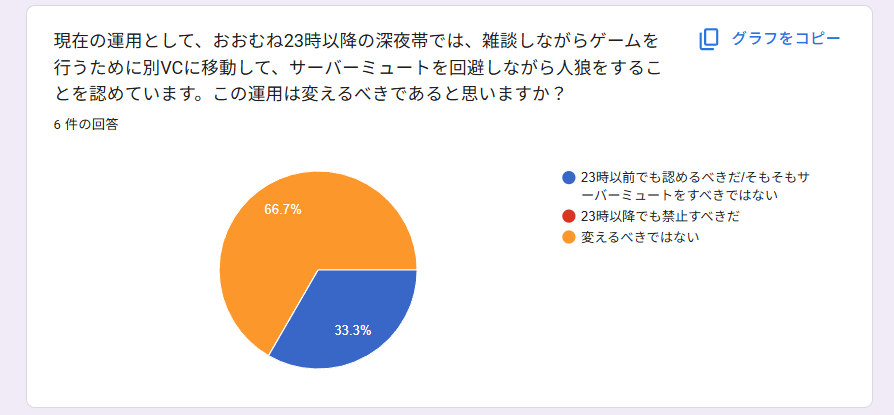

### 設問

現在の運用として、おおむね23時以降の深夜帯では、雑談しながらゲームを行うために別VCに移動して、サーバーミュートを回避しながら人狼をすることを認めています。この運用は変えるべきであると思いますか？

### 回答

- 変えるべきではない(4件)
- 23時以前でも認めるべきだ/そもそもサーバーミュートをすべきではない(2件)

### その他の選択肢

- 23時以降でも禁止すべきだ(0件)

### 運営方針

現行の運用を継続します。サーバーミュートの妥当性については一つ下の設問をご覧ください。

## サーバーミュートの妥当性

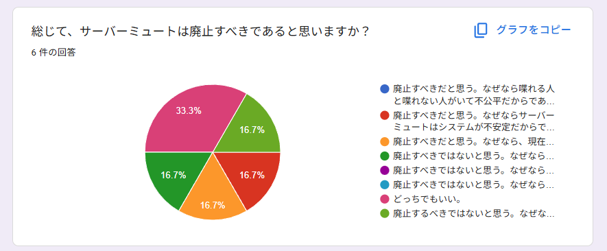

### 設問

総じて、サーバーミュートは廃止すべきであると思いますか？

### 回答

- どっちでもいい。(2件)
- 廃止するべきではないと思う。なぜなら死んだときなどに声を出してしまう方がいるかもしれないからである。(1件)
- 廃止すべきではないと思う。なぜならサーバーミュートは治安維持に一定寄与するからである。(1件)
- 廃止すべきだと思う。なぜならサーバーミュートはシステムが不安定だからである。(1件)
- 廃止すべきだと思う。なぜなら、現在の治安を考えるとセルフミュートでも十分試合は成り立つからである。(1件)

### その他の選択肢

- 廃止すべきだと思う。なぜなら喋れる人と喋れない人がいて不公平だからである。(0件)
- 廃止すべきではないと思う。なぜならサーバーミュートは現在の話題を強制的に遮断させる役割を持つからである。(0件)
- 廃止すべきではないと思う。なぜなら会議外では会話なしで人狼を行いたいからである。(0件)

### 分析

- 廃止すべきと回答した人と廃止すべきでないと回答した人が同数でした
- 「どちらでもいい」と回答した人もいます

### 運営方針

サーバーミュートを継続することと廃止することは背反する選択肢であるため、全てのニーズを満たすことはできません。  
今回のアンケートでは、以下の理由からサーバーミュートは**継続します**。

- 人狼はイベントが始まった2023年からサーバーミュートを実施しており、現在の運用に一定の実績があること
- 「会議外で試合に関する話をしない」というルールが性善説と参加者の認知に頼ってしまう形となるため、特に新規の人の混乱を招く可能性があること
- サーバーミュートの利活用が禁止されると、イベントの収集がつかなくなる可能性があること

## テレポートルーレットの妥当性

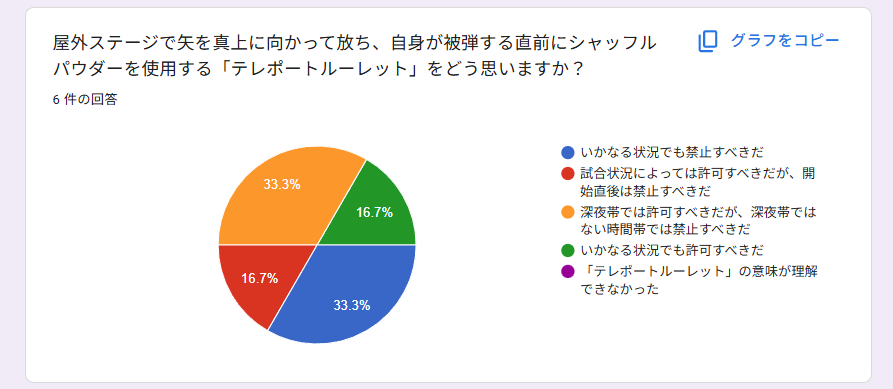

### 設問

屋外ステージで矢を真上に向かって放ち、自身が被弾する直前にシャッフルパウダーを使用する「テレポートルーレット」をどう思いますか？

### 回答

- いかなる状況でも禁止すべきだ(2件)
- 深夜帯では許可すべきだが、深夜帯ではない時間帯では禁止すべきだ(2件)
- 試合状況によっては許可すべきだが、開始直後は禁止すべきだ(1件)
- いかなる状況でも許可すべきだ(1件)

### その他の選択肢

- 「テレポートルーレット」の意味が理解できなかった(0件)

### 分析

- テレポートルーレットについては否定的な意見が多いです
- 一方、テレポートルーレットを容認すべきと考えている人もいます

### 運営方針

アンケートの結果を踏まえ、テレポートルーレットは23:00以降の深夜帯でのみ使用可能とし、23:00以前は使用禁止とさせていただきます。  
23時以前での使用を禁止するという判断は以下の理由にも基づくものです

- テレポートルーレットはごく一部の状況を除いて理論上自陣営を有利にすることがない
  - ごく一部の状況: 「自陣営の人数が敵陣営に比べて極端に少ない状況」「自身が妖狐であり、いずれかの陣営が残り一人の場合」「自身がエースの場合」など
- 上記「ごく一部の状況」に該当したとしても、今の人狼には自身の置かれた状況が理論上自陣営に有利であることを説明する機会が担保されていない
- テレポートルーレットには見方を不当に傷つける可能性がある

一方、深夜帯において使用可能とする判断は以下の理由にも基づくものです

- 深夜帯はほとんどのメンバーが固定されており、テレポートルーレットの使用にあたってモラルのインフォーマルな相互監視が期待できる
- 全ての時間帯で使用を禁止してしまうと、新たな攻略法の開拓や多様な試合展開が阻害されかねない

## /koguma・/harukitiの匿名チャット

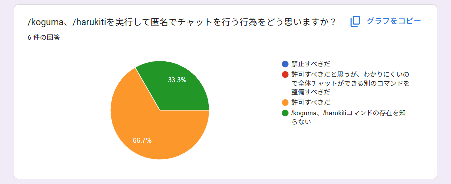

### 設問

/koguma、/harukitiを実行して匿名でチャットを行う行為をどう思いますか？

### 回答

- 許可すべきだ(4件)
- /koguma、/harukitiコマンドの存在を知らない(2件)

### その他の選択肢

- 禁止すべきだ(0件)
- 許可すべきだと思うが、わかりにくいので全体チャットができる別のコマンドを整備すべきだ(0件)

### 分析

- 多くの人が匿名チャットを問題視していないようです
- コマンドの存在を知らない人が一定数見受けられます

### 運営方針

現行の運用を継続します。

## トキシック

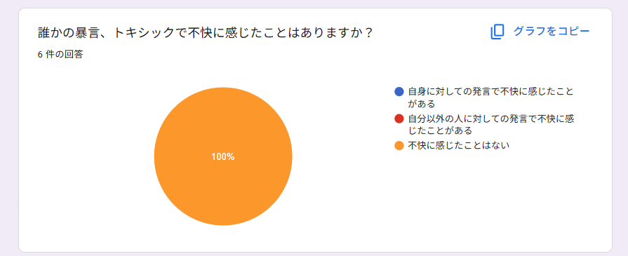

### 設問

誰かの暴言、トキシックで不快に感じたことはありますか？

### 回答

- 不快に感じたことはない(6件)

### その他の選択肢

- 自身に対しての発言で不快に感じたことがある(0件)
- 自分以外の人に対しての発言で不快に感じたことがある(0件)

### 運営方針

警告を行うかどうかの判断基準について、現行の運用を継続します。暴言に対しては引き続き注視します。

## 修復的司法の適用

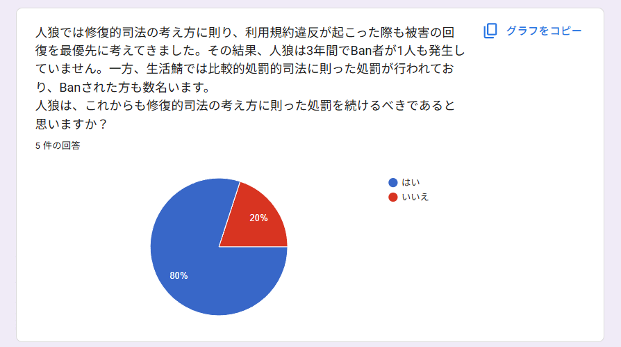

### 設問

人狼では修復的司法の考え方に則り、利用規約違反が起こった際も被害の回復を最優先に考えてきました。その結果、人狼は3年間でBan者が1人も発生していません。
一方、生活鯖では比較的処罰的司法に則った処罰が行われており、Banされた方も数名います。
人狼は、これからも修復的司法の考え方に則った処罰を続けるべきであると思いますか？

### 回答

- はい(4件)
- いいえ(1件)

### 備考

- 任意回答です
- 処罰的司法と修復的司法についての理解を深めるため、質問では以下の文章の一部を引用しました
  - 刑法雑誌 41巻2号 修復的司法の理念と実践 (西村 春夫)

### 運営方針

マイクラ人狼では引き続き修復的司法の考え方を積極的に採用します。なお、生活サーバーは運営主体が異なるため引き続き現在の処罰方針が採用されます。