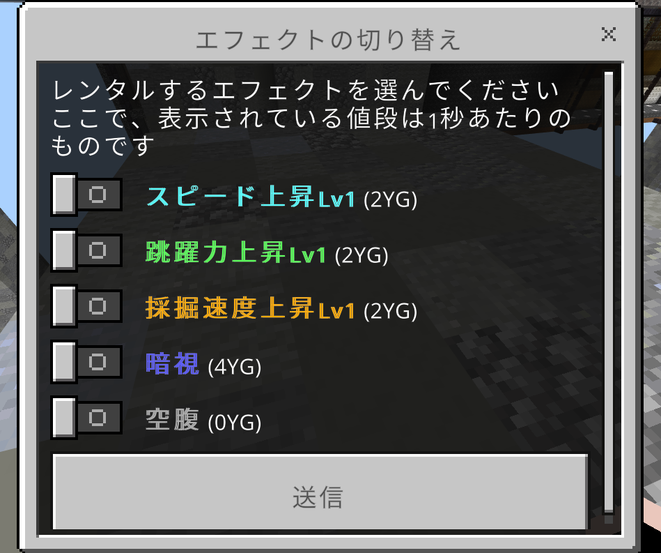

# エフェクトのレンタル

鯖内で/buffコマンドを実行することで、スピード上昇などのエフェクトを有料でレンタルすることができます

## エフェクトの値段と付与時間

「スピード上昇」「跳躍力上昇」「採掘速度上昇」エフェクトの値段は2YG/秒です。  
レンタル中は2秒に1回、2秒分の値段(=エフェクトごとに4YG)が自動で差し引かれます。

「暗視」エフェクトの価格は4YG/秒です。

「空腹」エフェクトの価格は0YGです。
:::caution 注意
エフェクトが不要になった場合は、必ず再度/buffを実行してエフェクトをオフにしてください。  
そのままにしておくと継続的にエフェクトのレンタル費用が差し引かれ続けます。
:::

## 販売するエフェクトの種類

2025年7月16日現在、販売しているエフェクトは「スピード上昇」「跳躍力上昇」「採掘速度上昇」「暗視」「空腹」の5つです。

## エフェクトを複数レンタルする

エフェクトは同時に複数レンタルすることもできます。その場合の1秒当たりの値段は、 2×(レンタルしているエフェクトの数)YG です。

## エフェクトがレンタルできないワールド

lobbyなどの一部のワールドでは、エフェクトのレンタルが行えません。

### エフェクトのレンタルを終了する

エフェクトのレンタルを終了する場合は、/buffでエフェクトをオフにするかサーバーから退出してください。

