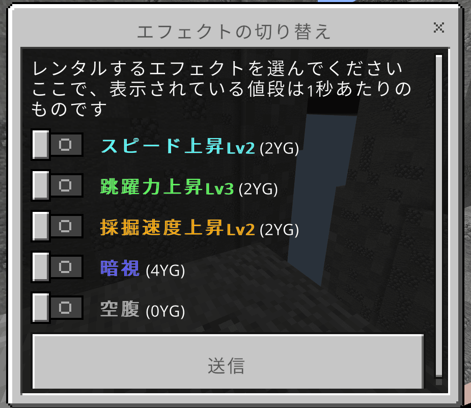

# エフェクトのレンタル

鯖内で`/buff`を実行すると、スピード上昇などのエフェクト(効果)を有料でレンタルできます。

## エフェクトの種類と値段

2025年7月16日現在、レンタルできるエフェクトは以下の5つです。

| エフェクト | 値段 |
|---|---|
| スピード上昇 | 2YG/秒 |
| 跳躍力上昇 | 2YG/秒 |
| 採掘速度上昇 | 2YG/秒 |
| 暗視 | 4YG/秒 |
| 空腹 | 0YG(無料) |

レンタル中は2秒に1回、2秒分の値段が自動で差し引かれます(例: 上の表で2YG/秒のエフェクトなら2秒ごとに4YG)。

:::caution 使い終わったら必ずオフに
エフェクトが必要なくなったら、必ずもう一度`/buff`を実行してエフェクトをオフにしてください。  
オンのままにしておくと、レンタル費用が引かれ続けてしまいます。
:::

## エフェクトを複数レンタルする

エフェクトは、同時に複数レンタルすることもできます。その場合の1秒当たりの値段は、**レンタルしているエフェクトそれぞれの値段を合計した金額**です(例: スピード上昇+暗視なら2+4=6YG/秒)。

## エフェクトをレンタルできないワールド

ロビーなど、一部のワールドではエフェクトのレンタルができません。

## エフェクトのレンタルを終了する

レンタルを終わりにするときは、`/buff`でエフェクトをオフにするか、サーバーから退出してください。

## コマンド

| コマンド | 説明 | 権限 |
|---|---|---|
| `/buff` | エフェクトのレンタル画面を開く | 全員 |
