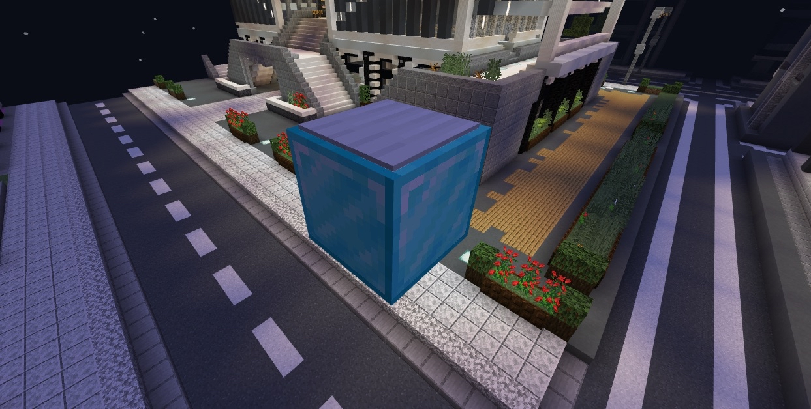

# エレベーター

エレベーターのような機能を作成できます。

作成方法は、**鉄ブロックの上に鉄の重量感圧版**を置くことで作成でき、ジャンプで上位階、スニークで下位階に移動できます。ブロック間の距離は**3マス以上8マス以下**である必要があります。

また、上位機能としてダイヤモンドブロックを使用したエレベーターも作成できます。

このエレベーターでは従来の8mを大幅に上回る上下各50mの移動が可能となります。

