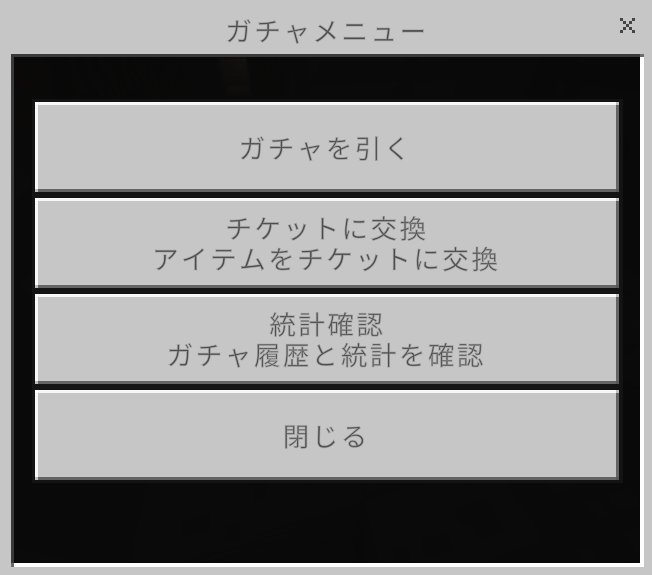
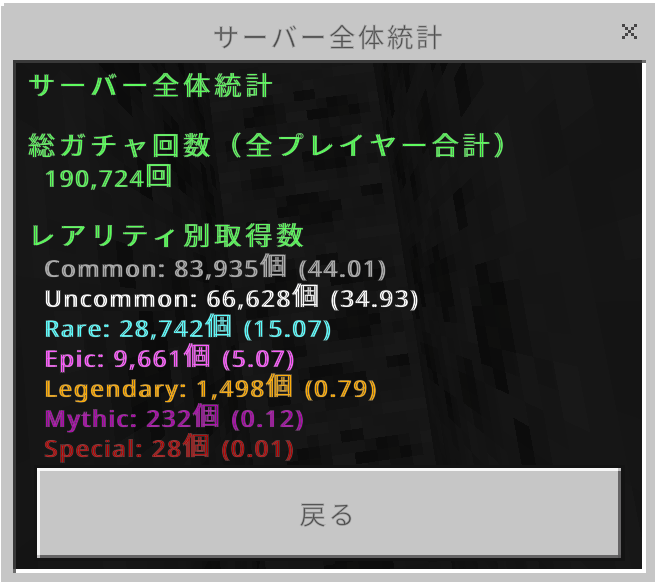

# ガチャ
このプラグインを使用することでゲーム内でガチャを引いてアイテムを獲得することができます。

## ガチャの種類
現在実装されているガチャは通常ガチャ(1回につきチケット1枚消費)・昼限定ガチャ(1回につきチケット2枚消費)があります。昼限定ガチャは毎日午前11時から午後3時まで引くことができます。
また、期間限定ガチャも不定期で開催しています。

## ガチャの引き方
/gachaでガチャのフォームを開いて『ガチャを引く』を選択して引きたいガチャを選択します。
引きたいガチャを選択して何回ガチャを引くかをフォームに入力して『送信』ボタンを押すとガチャを引くことが出来ます。

## ガチャチケットの交換レート

|                           |             | 
| ------------------------- | ----------- | 
| 1200YG                    | チケット1枚 | 
| レッドストーンブロック3個 | チケット1枚 | 
| ラピスラズリブロック1個   | チケット1枚 | 
| 小麦の俵12個         | チケット1枚 | 
| がちゃチケット            | チケット3枚 | 

## 統計確認

サーバー全体の統計と個人の統計を確認できます。
統計画面ではガチャを引いた数と今まで排出されたアイテムの数と排出確率が表示されます。

