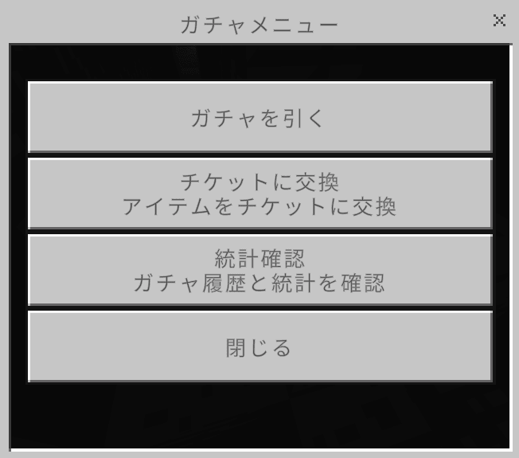
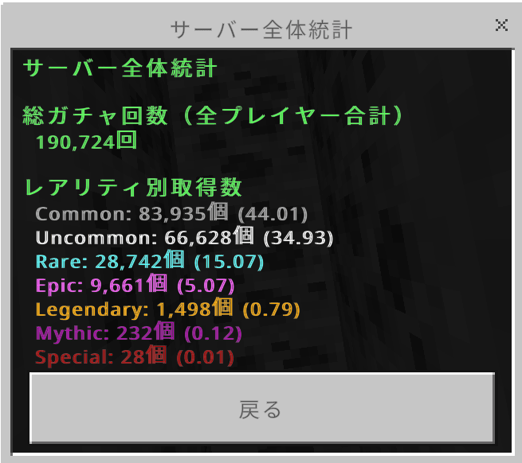

# ガチャ

ゲーム内でガチャを引いて、さまざまなアイテムを獲得できる機能です。

## ガチャの種類

| ガチャ | 引くのに必要なもの | 引ける時間帯 | 特徴 |
| --- | --- | --- | --- |
| 通常ガチャ | チケット1枚 | いつでも | — |
| 平日ランチタイムガチャ | チケット2枚 | 平日(月〜金)の午前11時〜午後3時 | 通常ガチャよりレアなアイテムが出やすくなっています |
| ダイヤモンドガチャ | ダイヤモンド2個 | いつでも(1日50回まで) | 景品は通常ガチャと同じですが、レアなアイテムがかなり出やすくなっています |

このほか、期間限定ガチャも不定期で開催しています。

:::tip
ガチャを1回引くごとに、1%の確率で[エンチャント本](https://docs.ymg24.org/docs/living/commands/enchant)がおまけで付いてきます。  
とてもレアな景品(Mythic以上)を引き当てると、チャットでサーバー全体にお知らせが流れます。
:::

## ガチャの引き方

`/gacha`(別名 `/gatya`)でガチャのフォームを開き、「ガチャを引く」を選んでから引きたいガチャを選びます。  
何回引くか(1〜250回)をフォームに入力して「送信」ボタンを押すと、まとめて引くことができます。

## ガチャチケットの交換レート

以下のものは、ガチャメニューの「チケットに交換」からガチャチケットへ交換できます。

| 交換に必要なもの | もらえるチケット |
| ------------------------- | ----------- |
| 1200YG | チケット1枚 |
| レッドストーンブロック3個 | チケット1枚 |
| ラピスラズリブロック1個 | チケット1枚 |
| 小麦の俵12個 | チケット1枚 |
| がちゃチケット(3枚) | チケット3枚 |

## 統計確認

サーバー全体の統計と、自分の統計を確認できます。  
統計画面では、ガチャを引いた回数・これまでに出たアイテムの数・出る確率が表示されます。

## 図鑑

これまでに出たアイテムの図鑑をフォームから確認できます。集めた景品の種類が50%に達するとチケットと記念メダルがもらえ、100%(コンプリート)するとさらに豪華な報酬がもらえます。

記念メダルを手に持つと、数秒間パーティクルの演出が出ます。

## 使うと効果がある景品

ガチャの景品の中には、**手に持ってタップ(PCでは右クリック)すると効果が出る**アイテムが約25種類あります。

| 種類 | 例 |
|---|---|
| お金がもらえる | 小切手、レッドワイン、ギフトカード、ビットコイン、大エメラルド |
| チケットがもらえる | 記念金貨、記念銀貨、管理システムコア |
| ワープ・移動 | テレポーター、偽造市民登録端末、違法転送ビーコン |
| その他 | ゴッドポーション、すごいリンゴ、隕石、ミステリーボックス など |

このほか、飾り用の**帽子**(70種類)も景品に含まれています。頭の防具スロットに入れると帽子として表示され、攻撃を受けても壊れません(→[よもぎ端末とオリジナルアイテム](https://docs.ymg24.org/docs/living/commands/custom-items))。

## コマンド

| コマンド | 説明 | 権限 |
|---|---|---|
| `/gacha`(別名 `/gatya`) | ガチャのメインメニューを開く | 全員 |
| `/gacha draw` | ガチャの種類選択を直接開く | 全員 |
| `/gacha exchange` | チケット交換を直接開く | 全員 |
| `/gacha zukan` | 図鑑を直接開く | 全員 |
| `/gacha stats` | 自分の統計を直接開く | 全員 |
| `/gacha ranking` | ランキングを開く | 全員 |
