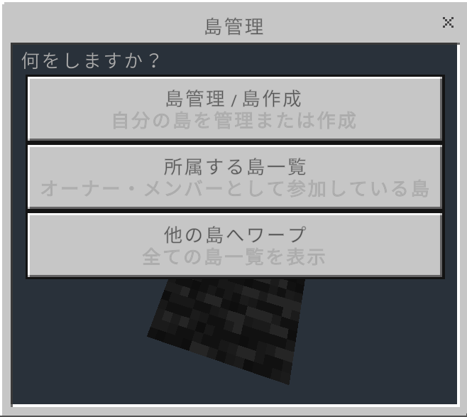

# 島プラグイン

島プラグインを使用すると自分だけのワールドを作成することが出来ます。
作成には10,000,000YGが必要です。

## 作成方法

/islandで島の作成・管理画面のフォームを開いて『島管理/島作成』を押して10,000,000YGを支払うことで島を作成できます。

## 島の管理

島を作成後『島管理/島作成』のメニューを選択すると島の管理画面を開くことができます。

| メニュー       | 機能                                                                               | 注意点                                                                                   | 
| -------------- | ---------------------------------------------------------------------------------- | ---------------------------------------------------------------------------------------- | 
| この島へワープ | 別のワールドから自分の島へワープすることができます。                               |                                                                                          | 
| プレイヤー招待 | 他のプレイヤーを自分の島へ招待することが出来ます。                                 |                                                                                          | 
| メンバー削除   | 招待したほかのプレイヤーを削除することが出来ます。                                 |                                                                                          | 
| 島を拡張       | 島の大きさを拡張することが出来ます。金額と拡張できるサイズは以下に記載します。 |                                                                                          | 
| ホーム設定     | 自分の島のスポーン地点を設定することができます。                                   |                                                                                          | 
| 島を削除       | 作成した島を削除することができます。                                               | 島を削除しても作成費用は戻りません。一度削除してしまったら復元することはできません。 | 

## 島の拡張
島の拡張範囲と拡張費用は以下の表の通りです。

| 拡張回数 | 拡張費用    | 拡張後の広さ | 
| -------- | ----------- | ------------ | 
| 1回      | 1,000,000YG | 120×120      | 
| 2回      | 1,500,000YG | 140×140      | 
| 3回      | 2,250,000YG | 160×160      | 
| 4回      | 3,375,000YG | 180×180      | 
| 5回      | 5,062,500YG | 200×200      | 
