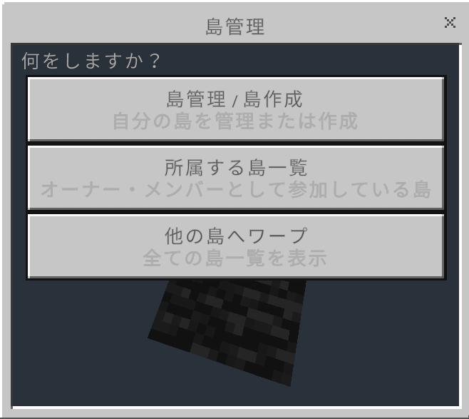

# 島プラグイン

自分だけの独立したワールド(島)を作れる機能です。作成には1,500,000YGが必要な、大きな買い物です。

## 作成方法

`/island`で島の作成・管理フォームを開いて「島管理/島作成」を押し、1,500,000YGを支払うと島を作成できます。  
作れたばかりの島の広さは16×16(中心から半径8ブロック)で、何もない空間(Void)の中に岩盤が1つだけ置かれた状態から始まります。

## メニューでできること

| メニュー | 機能 |
|---|---|
| 島管理/島作成 | 島を持っていなければ作成(有料)、持っていれば管理画面を開く |
| 所属する島一覧 | 自分がオーナー、またはメンバーとして参加している島の一覧を表示する |
| 他の島へワープ | **公開設定**にしている他プレイヤーの島の一覧からワープする |
| 島ランキング | 大きさ・メンバー数・開拓日(古さ)のランキングを表示する(公開設定の島が対象) |

## 島の管理

自分の島の管理画面(「島管理/島作成」)からは、以下の操作ができます。

| メニュー | 機能 | 注意点 |
|---|---|---|
| この島へワープ | 別のワールドから自分の島へワープする | |
| プレイヤー招待 | 他のプレイヤーを自分の島のメンバーに招待する | |
| メンバー削除 | 招待したメンバーを削除する | |
| 飛行許可 | メンバーごとに、自分の島での飛行を許可するか設定する | オーナーは常に自島で飛行できます |
| 公開/非公開の切り替え | 「他の島へワープ」やランキングに載せるかを切り替える | |
| 島を拡張 | 島の大きさを拡張する(有料。詳細は下記) | |
| ホーム設定 | 自分の島のスポーン地点を設定する | |
| 島を削除 | 作成した島を削除する | 作成費用は戻らず、削除すると復元できません |

## 島の拡張

島を広げたときの広さと費用は、以下の表の通りです。拡張するたびに費用は1.5倍になっていきます。

| 拡張回数 | 拡張費用 | 拡張後の広さ |
| -------- | ----------- | ------------ |
| 1回 | 1,000,000YG | 36×36 |
| 2回 | 1,500,000YG | 56×56 |
| 3回 | 2,250,000YG | 76×76 |
| 4回 | 3,375,000YG | 96×96 |
| 5回 | 5,062,500YG | 116×116 |

島の広さは、最大400×400まで拡張できます。

## 島の保護

島にはメンバー以外が入ってもブロックを置いたり壊したりできないよう保護がかかっており、ワールドボーダー(島の境界線)の外側も編集できません。奈落へ落ちてしまった場合も、自動的に助けてもらえます。

## コマンド

| コマンド | 説明 | 権限 |
|---|---|---|
| `/island` | 島の作成・管理フォームを開く | 全員 |

:::caution 長期間ログインしないと削除されます
オーナー・メンバーの**誰もログインしないまま60日が経過した島は、削除されます**。旅行や長期休暇などで長く空ける場合はご注意ください。
:::
