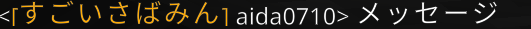
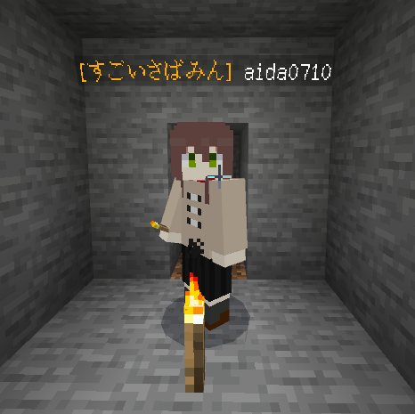
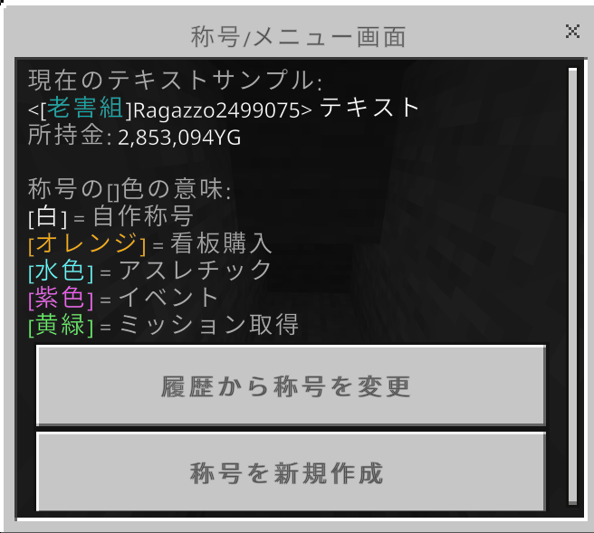

# 称号プラグイン(Rankプラグイン)

称号プラグインを使用することで名前やチャット上で称号を付与することができます。

## コマンド

| command | 説明                               | 権限 | 
| :------ | ---------------------------------- | ---- | 
| /rank   | 称号プラグインのフォームを開きます | 全員 | 
|         |                                    |      | 
|         |                                    |      | 

## 称号の新規作成方法

フォームを開いて作成したい称号を入力してください。(太字斜文字が入った称号はユーザーが作成することはできません)
下の支払い確認にチェックをして5000YGを支払うことで称号を作成することができます。

## 称号の[]の色

白色　　=　　自作称号  
オレンジ　=　　看板購入  
水色　　=　　アスレチック報酬  
紫色　　=　　イベント  
黄緑　　=　　ミッション取得  

