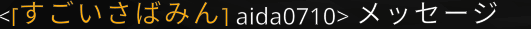
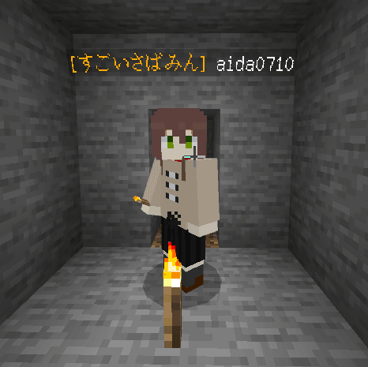
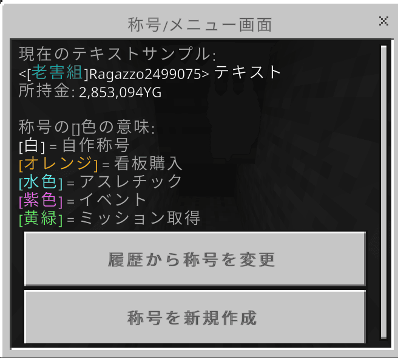

# 称号プラグイン

称号プラグインを使用すると、名前の前やチャット上に自分だけの「称号」を表示できます。一度取得した称号は履歴に残り、以後は無料で付け替えられます。

## コマンド

| コマンド | 説明 | 権限 |
| :------ | ---------------------------------- | ---- |
| `/rank` | 称号メニューを開く(作成・付け替えもここから行えます) | 全員 |
| `/makerank` | オリジナルの称号をお金で作成する | 全員 |
| `/chgrank` | 取得済みの称号の中から付け替える | 全員 |

## 称号の作り方

`/rank`のフォームを開き、作りたい称号を入力してください。**太字・斜体が入った称号は、プレイヤーが作成することはできません**。

下にある支払い確認にチェックを入れて5,000YGを支払うと、称号が作成されます。称号は**最大10文字**(装飾コードを除く)まで設定できます。

:::tip 一度作った称号は使い回せます
称号は取得した時点で履歴に残ります。一度作成・購入した称号を後で外しても、`/chgrank`からいつでも無料で再装備できます。
:::

## 称号の入手方法いろいろ

自作以外にも、以下のような方法で称号を手に入れられます。

- **看板ショップでの購入** — 街なかなどに設置されている称号ショップの看板をタップ(PCでは右クリック)して購入する
- **アスレチックの報酬**
- **イベントでの配布**
- **[ミッション](https://docs.ymg24.org/docs/living/commands/mission)の達成報酬**

## 称号を囲む[ ]の色の意味

称号を囲む`[ ]`の色によって、その称号をどうやって手に入れたかが分かります。

| 色 | 入手方法 |
|---|---|
| 白色 | 自作称号 |
| オレンジ | 看板購入 |
| 水色 | アスレチック報酬 |
| 紫色 | イベント |
| 黄緑 | ミッション取得 |

