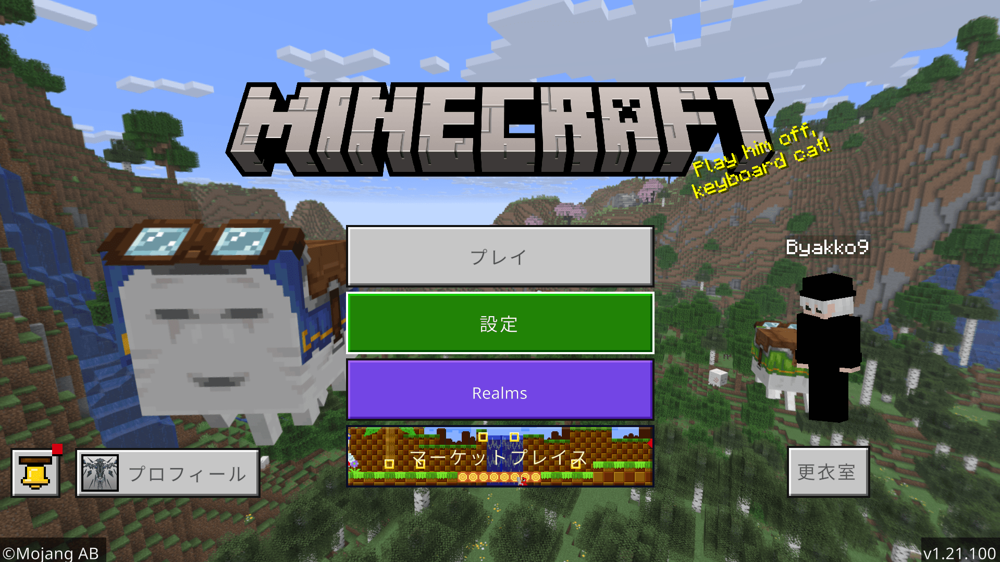
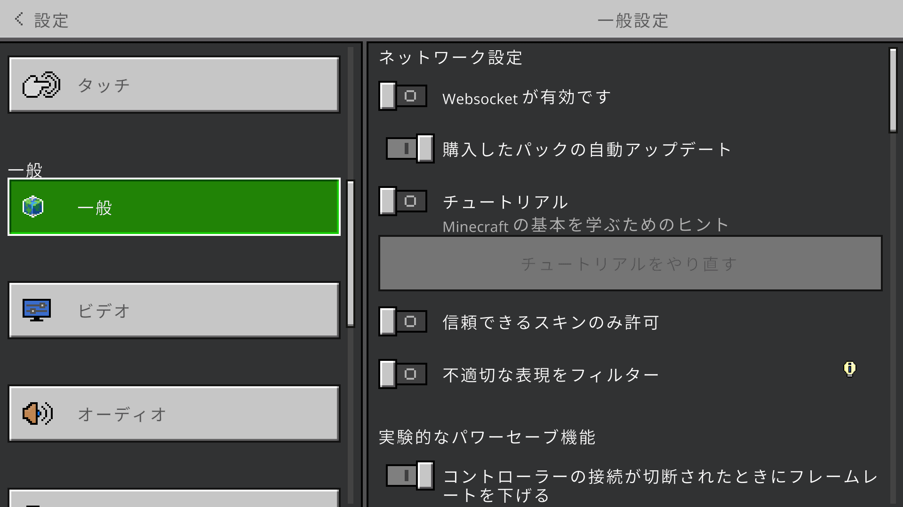
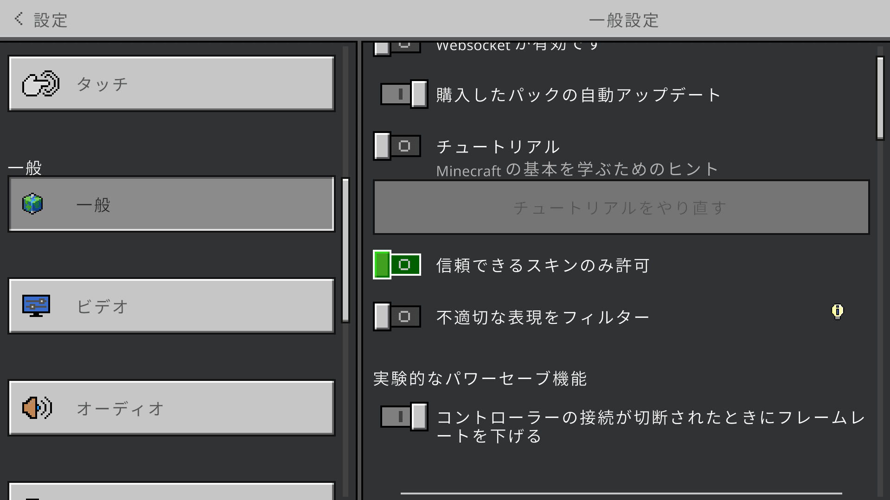
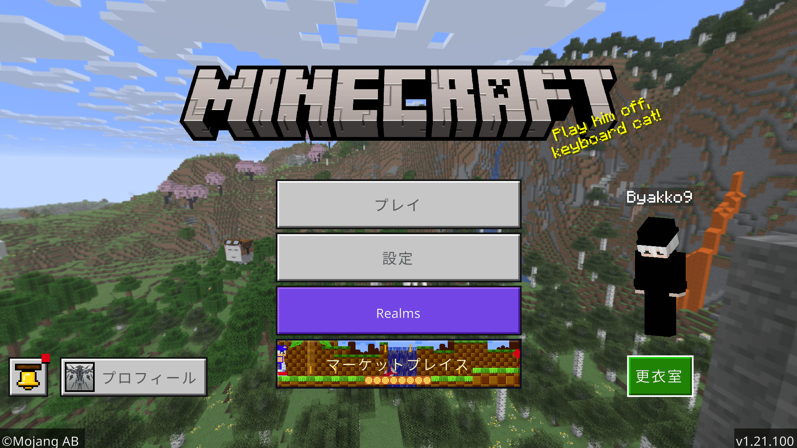
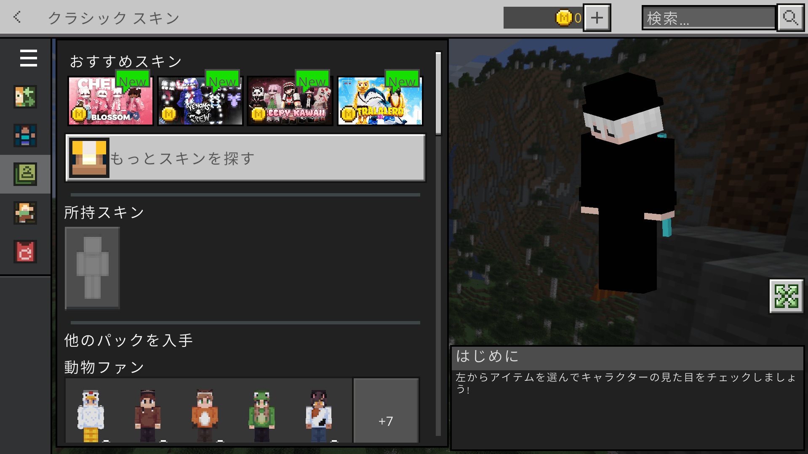
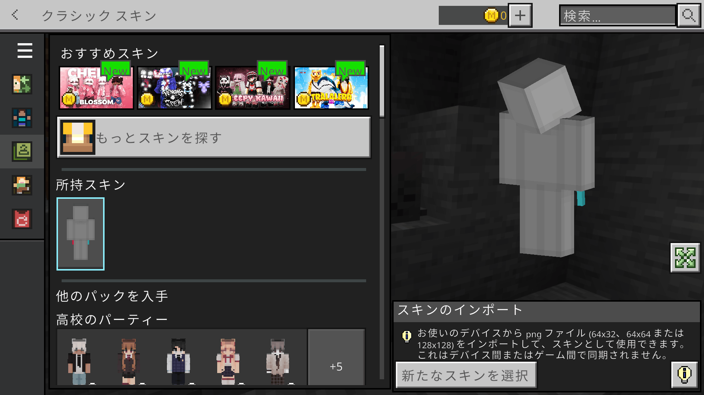

# プレイヤーのスキンが正常に表示されません

正常に表示されないのが相手なのか自分なのかによって、対処方法が異なります。

### ① 相手のスキンが正常に表示されない場合

① 「設定」項目を選択します

② 「一般」項目を選択します

③ 「信頼できるスキンのみ許可」項目をオフにします

### ② 自分のスキンが正常に表示されない場合

① 「更衣室」項目を選択します

② 「クラシックスキン」項目を選択します

③ 「所持スキン」項目を選択します

④ 「新たなスキン」項目を選択し、スキンのインポート(読み込み)を行ってください
