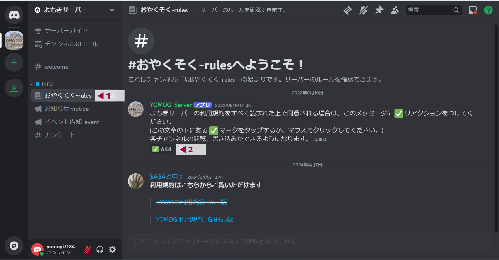
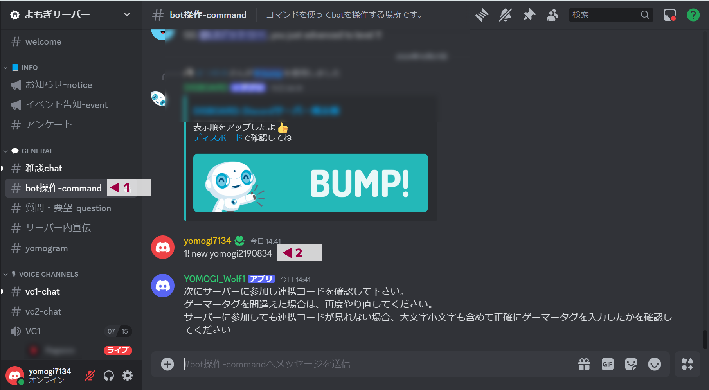
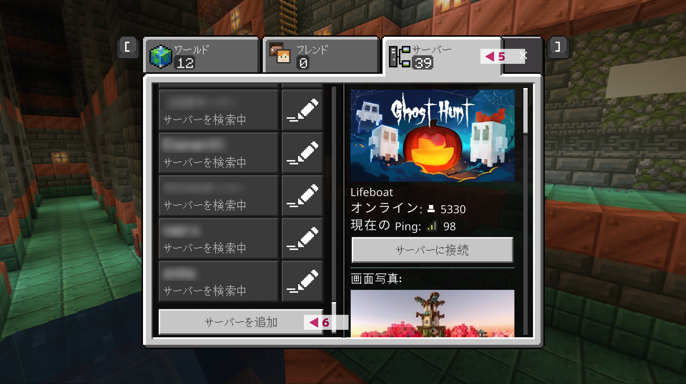
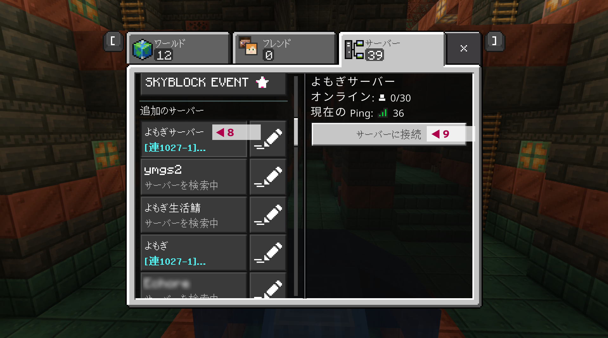

# 生活サーバーの参加方法

> 下にスクロールしてください。次のページに進むことができるボタンがあります。

### 事前準備
よもぎサーバーの生活サーバーに参加するにはこれらが必要ですので、事前にご準備をお願いします。
- Discordアカウント
- Minecraft**統合版**

「Discord」とは主にゲーマー向けに作られたオンラインのチャット・音声通話アプリです。基本的な機能は全て無料で利用できます。

:::caution 注意
- Minecraft Java版では参加できません
- Nintendo Switchでも参加できますが、少々操作が必要になります
  :::

### ①Discordサーバーに参加する

[こちらのDiscordサーバー招待ページ](https://discord.gg/5Ck73dDgHs)からよもぎサーバーのDiscordに参加します

### ②利用規約に同意する

1. Discordの #おやくそく-rules チャンネルに移動します
2. ✅ボタンを押して[利用規約](https://docs.ymg24.org/docs/category/%E5%88%A9%E7%94%A8%E8%A6%8F%E7%B4%84)に同意します。

利用規約に同意しない場合、人狼用のVCに参加できません。  
✅ボタンを押すことで、Discord上の全てのチャンネルが閲覧できるようになります。

### ③MinecraftとDiscordを連携する
あなたが持っているMinecraftアカウントとDiscordアカウントを連携します。  
人狼サーバーに参加するためには必ずこの操作が必要です。

:::note
よもぎ鯖のマイクラ人狼イベントと生活サーバーでは共通の連携データを利用しています  
あなたが生活サーバーの一部機能を利用した際に、ここでの連携データが利用されることがあります
:::

1. Discordの #bot操作-command チャンネルに移動します
   :::caution 注意
   参加準備は順番通りに行ってください。②の利用規約への同意を行わないと、このチャンネルには移動できません
   :::
2. 「1! new &lt;あなたのMinecraftゲーマータグ&gt;」とチャットします
   :::caution 注意
- 1!とnewとゲーマータグの間に、それぞれ半角スペースが必要です
- ゲーマータグは、大文字と小文字を区別して正確に入力してください
  :::

3. Minecraftの統合版を起動します
4. 「プレイ」をクリックします

5. 「サーバー」をクリックします
6. 下にスクロールし、「サーバーを追加」をクリックします

:::caution 注意
- 「サーバーを追加」ボタンが存在しない場合は[こちらのよくある質問のページ](https://docs.ymg24.org/docs/wolf/faq)の下部にある「Nintendo Switchでも参加できますか？」「PS4/PS5でも参加できますか？」の項目をご覧になり、サーバーを追加してください
- 追加が終了しましたら、サーバーに参加になり、10へお進みください
:::

7. サーバー名に「よもぎサーバー」、サーバーアドレスに「ymgs.f5.si」、ポートに「19132」と入力し、「保存」をクリックします

8. 作成したサーバーをクリックします
9. 「サーバーに接続」をクリックします

10. 画面に表示される連携コードを確認します

:::caution 注意
- 連携コードが見れない場合は、[こちらのよくある質問のページ](https://docs.ymg24.org/docs/wolf/faq)をご覧ください
:::

11. Discordに戻り「1! auth &lt;連携コード&gt;」と入力します

:::caution 注意
- 1!とauthと連携コードの間に、それぞれ半角スペースが必要です
- 連携コードは、半角数字か半角英語の小文字です。数字のゼロ(0)とイチ(1)はありますが、アルファベットのエル(l)とオー(o)はありません
- 連携コードを忘れた場合は、再度マインクラフトサーバーに参加することで確認できます
:::

### ④近距離VCに参加する

https://vc.ymg24.org/?serverId=1 を利用して近距離VCに参加してください。参加の際にDiscordのログインが求められた場合は、ログインを行ってください。

:::caution 注意
- 近距離VCに参加できない場合は、[こちらのよくある質問のページ](https://docs.ymg24.org/docs/living/faq/lvc-faults)をご覧ください
:::

:::note
近距離VCについての詳細は https://docs.ymg24.org/docs/living/commands/limited-vc でご覧になれます。
:::

### ⑤生活サーバーに参加する

連携時と同様にしてサーバーの追加を行います。  
サーバー名に「よもぎ生活鯖」、サーバーアドレスに「ymg24.org」、ポートに「19132」と入力してください。