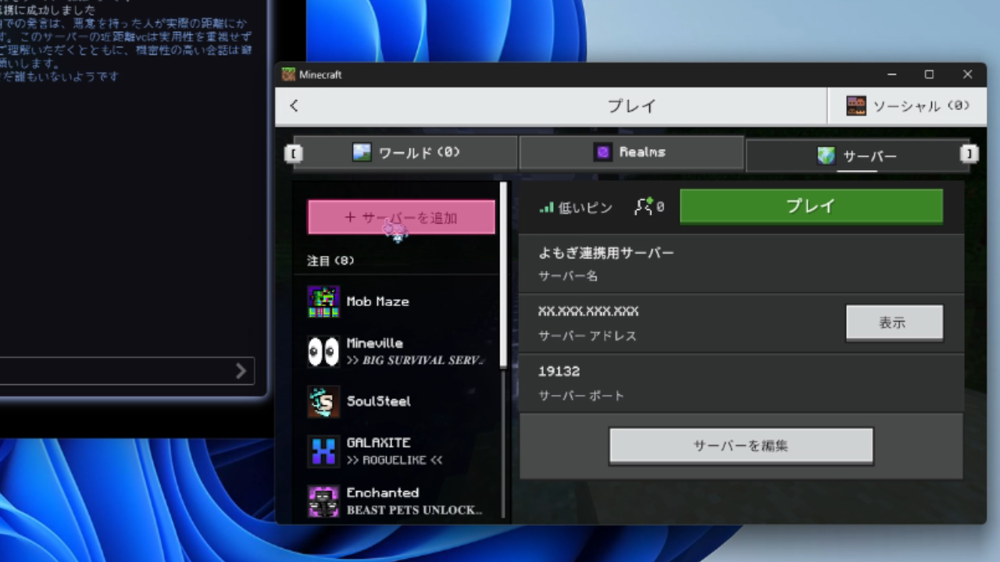
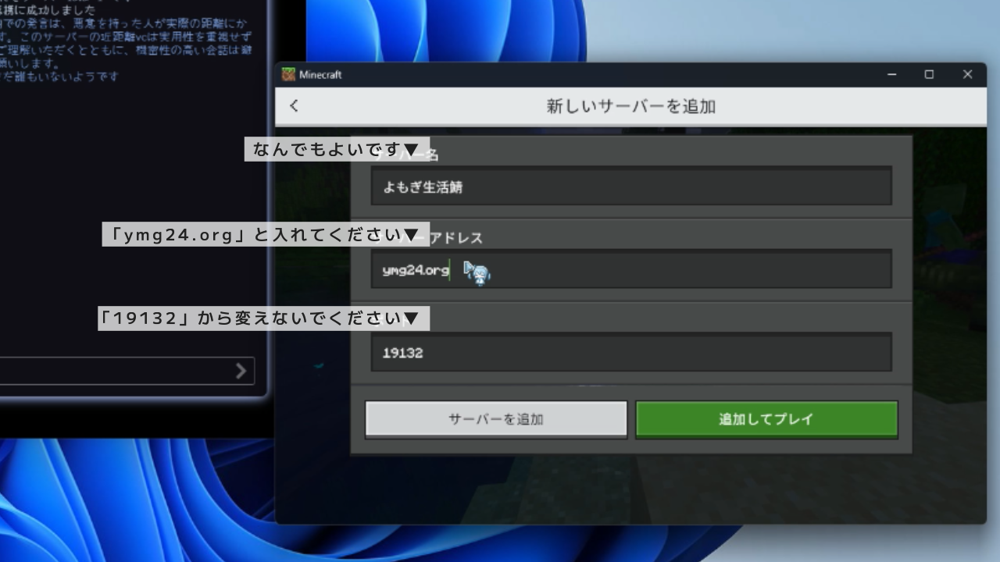

# 生活サーバーの参加方法

> 下にスクロールしてください。次のページに進むことができるボタンがあります。

### 事前準備
よもぎサーバーの生活サーバーに参加するにはMinecraft**統合版**が必要ですので、事前にご準備をお願いします。

:::caution 注意
- Minecraft Java版では参加できません
- Nintendo Switchでも参加できますが、少々操作が必要になります
  :::

### Minecraftサーバーに参加する

➀ Minecraftの統合版を起動し、「プレイ」をクリックします  
②「サーバー」をクリックします  
③ 画面左上の「サーバーを追加」をクリックします

:::caution 注意
Nintendo Switchの方は「サーバーを追加」ボタンがありません。  
サーバーの追加方法については https://docs.ymg24.org/docs/living/faq/device をご覧ください。
  :::

④ サーバー名に好きなサーバー名を、サーバーアドレスに「ymg24.org」、ポートに「19132」と入力してください。  

⑤ 「追加してプレイ」をクリックします　　
⑥ サーバーに参加できます　　

:::caution 注意
サーバーに参加できない場合は https://docs.ymg24.org/docs/living/faq/joining-faults をご覧ください。
  :::