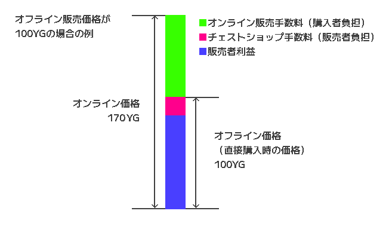

# チェストショップ

チェストショップの詳細な仕様について説明します。  
簡単な説明は https://docs.ymg24.org/docs/living/commands/chest-shop で見ることができます。

## チェストショップの作成要件

チェストショップは、以下の条件をすべて満たす場合に作成できます。  
 - チェストの前面にオークの看板が設置されていること
 - 作成者がチェストのある土地の所有者である、または土地共有をうけていること
 - チェストと看板が複数の土地にまたがっていないこと

ダブルチェストをチェストショップにする場合は、さらに以下の条件も満たす必要があります。
 - チェストが複数の土地にまたがっていないこと
 - そのチェストがチェストショップとして登録されていないこと

## チェストショップの手数料

チェストショップの商品が客によって購入された際、収益のうちの7\%が手数料として徴収されます。  
さらにオンライン販売時は、購入者が代金の70\%をオンライン販売手数料として支払う必要があります。  

ここで、7\%の販売手数料は販売者負担であることに注意すると、物品の代金をその最低販売価格にすることは規約違反ではないと判断することができます。  
例えば、ダイヤモンド1つを2300YGで販売した場合、購入者が得ることのできる収益は2139YGで最低販売価格を下回っていますが、販売自体は2300YGで行われているため規約違反にはなりません。  
しかしながら、オンライン販売はその利便性を購入者が別途手数料を支払うことにより購入しているとみなしています。  
この点に注意すると、たとえチェストショップがオンライン販売のみを前提としている場合であっても、170\%の代金を支払うことでようやく最低販売価格を超過するような値段設定を行うことは規約違反であると判断できます。  
例えば、ダイヤモンドを販売するチェストショップは、たとえ地中に埋めていたとしても、1353YGの値段設定を行うことはできません。  

## チェストショップ作成時の補足事項

チェストショップ作成時に看板に書かれた内容は、作成時に破棄されます。  
従来のチェストショッププラグインが看板に直接内容を書き込むものが多い中、このサーバーのプラグインでformを採用しているのは、かつてに比べアイテムIDを調べることが困難になったことや、Switchなどのタイピングに時間のかかるプレイヤーが多いことが理由です。  
作成時のformの販売アイテムIDは、標準ではチェストの左上に入っているアイテムのものになります。チェストの左上にアイテムが置かれていない場合はプレイヤーが左手に所有するアイテムのIDが記述され、手に何も持っていない場合は空欄になります。

### 販売アイテムIDの例外

「なめらかなクオーツ(Smooth Quartz Block)」は、標準で入力されたIDのままでは販売することができません。  
これは、アイテム名から導出されるIDと、アイテムの導出に用いるIDが一部異なっているというMinecraftの仕様に起因しています。  
当該のアイテムは、「Smooth Quartz」と入力することで販売が可能です。  

## チェストショップで販売できないアイテム

アイテムのNBTタグがデフォルトのアイテムと一致しないアイテムは販売することができません(在庫としてカウントされません)。  
NBTタグがデフォルトと一致しないアイテムの例を以下に列挙しますが、この限りではありません。
 - 耐久を消費したツールや防具
 - エンチャントのついたアイテム
 - 内容が書かれた本
 - 名前や説明文が変更されたアイテム

## チェストショップの本質的意義と非推奨行為

チェストショップは本来、基本的なアイテムを不特定多数に販売できるようにするために導入されました。  
そのことを踏まえると、以下の行為は規約違反ではないものの、非推奨です。  
 - 身内間での取引にチェストショップを利用する(第三者に購入される可能性があります)
 - オンライン販売のみを前提としたチェストショップを作成する(オンラインでの購入方法は事前の告知なしに変更される可能性があります)
 - 物品の購入費用以外の料金収受をチェストショップを利用して行う(客が確かに購入したことを保証する術がなく、紛争の原因になります)
 - クーポン券を販売するなど、販売するアイテムに付加価値を設ける(客が手にしたアイテムがチェストショップで購入されたものかを確かめる術がありません)

## オンライン販売

2025年5月15日以降、チェストショップ内のアイテムが遠隔で購入できるようになりました。  
これは、頻繁に消耗するツール類や松明などのアイテムをいちいち購入しに現地に向かわなくとも購入できるようにしてほしいという需要を満たすためのものであり、
機能を作成するにあたっては、車の価値やスポーン地点に近い土地の価値の低下を最大限に防止する必要がありました。そのために設定した仕様は以下の通りです。  
 - オンライン販売の手数料を70\%と高額に設定しました。  
 - ショップの検索機能は設けませんでした。スポーン地点に近い土地の価値の低下を防ぐためです。  
 - 遠隔購入時は、逐一ショップのIDを入力しなければならないようにしました。IDの記憶や管理にはコストがかかるため、手軽に購入できるチェストショップの数に実質的な制限をかける狙いがあります。
 - 商品の在庫があるかどうかは、実際に購入するまでわからないようにしました。在庫状況を取引なしに閲覧することを防止するためです。