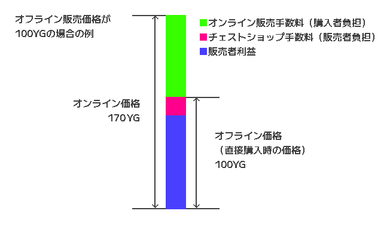

# チェストショップ

チェストショップの詳細な仕様について説明します。  
簡単な説明は[チェストショップのページ](https://docs.ymg24.org/docs/living/commands/chest-shop)で見ることができます。

## チェストショップの作成要件

チェストショップは、以下の条件をすべて満たす場合に作成できます。

- チェストの前面にオークの看板が設置されていること
- 作成者がチェストのある土地の所有者である、または土地共有を受けていること
- チェストと看板が複数の土地にまたがっていないこと

ダブルチェストをチェストショップにする場合は、さらに以下の条件も満たす必要があります。

- チェストが複数の土地にまたがっていないこと
- そのチェストがチェストショップとして登録されていないこと

## チェストショップの手数料

チェストショップの商品が客によって購入された際、収益のうちの8%が手数料として徴収されます。  
さらにオンライン販売時は、購入者が代金の70%をオンライン販売手数料として支払う必要があります。

ここで、8%の販売手数料は販売者負担であることに注意すると、物品の代金をその[最低販売価格](https://docs.ymg24.org/docs/living/supplement/minimum-price)と同額にすることは規約違反ではないと判断できます。  
例えば、ダイヤモンド1つを2,300YGで販売した場合、販売者が受け取れる金額は2,116YGで最低販売価格を下回りますが、販売自体は2,300YGで行われているため規約違反にはなりません。  
しかしながら、オンライン販売については、購入者がその利便性を別途手数料を支払って購入しているとみなしています。  
この点に注意すると、たとえチェストショップがオンライン販売のみを前提としている場合であっても、170%の代金を支払うことでようやく最低販売価格を超えるような値段設定を行うことは規約違反であると判断できます。  
例えば、ダイヤモンドを販売するチェストショップは、たとえ地中に埋めていたとしても、1,353YGという値段設定を行うことはできません。

## チェストショップ作成時の補足事項

チェストショップ作成時に看板へ書かれていた内容は、作成と同時に消去されます。  
従来のチェストショッププラグインには看板に直接内容を書き込むものが多い中、このサーバーのプラグインがフォーム(入力画面)を採用しているのは、かつてに比べてアイテムIDを調べることが難しくなったことや、Switchなどタイピングに時間のかかるプレイヤーが多いことが理由です。  
フォームの販売アイテムIDは、標準ではチェストの左上に入っているアイテムのIDが入力されます。チェストの左上にアイテムが置かれていない場合はプレイヤーが左手に持っているアイテムのIDが入力され、手に何も持っていない場合は空欄になります。

### 販売アイテムIDの例外

「なめらかなクオーツ(Smooth Quartz Block)」は、標準で入力されたIDのままでは販売することができません。  
これは、アイテム名から導出されるIDと、アイテムの導出に用いるIDが一部異なっているというMinecraftの仕様に起因しています。  
当該のアイテムは、「Smooth Quartz」と入力することで販売が可能です。  

## チェストショップで販売できないアイテム

NBTタグ(アイテムに付いている追加のデータ)が初期状態と一致しないアイテムは、販売することができません(在庫としてカウントされません)。  
NBTタグが初期状態と一致しないアイテムの例を以下に挙げますが、これがすべてではありません。

- 耐久値を消費したツールや防具
- エンチャントのついたアイテム
- 内容が書かれた本
- 名前や説明文が変更されたアイテム

## チェストショップの本来の意義と非推奨行為

チェストショップは本来、基本的なアイテムを不特定多数に販売できるようにするために導入されました。  
そのことを踏まえると、以下の行為は規約違反ではないものの、推奨されません。

- 身内どうしの取引にチェストショップを利用する(第三者に購入される可能性があります)
- オンライン販売のみを前提としたチェストショップを作成する(オンラインでの購入方法は事前の告知なしに変更される可能性があります)
- 物品の購入費用以外の料金の受け取りにチェストショップを利用する(客が確かに購入したことを保証する手段がなく、トラブルの原因になります)
- クーポン券を販売するなど、販売するアイテムに付加価値を設ける(客が手にしたアイテムがチェストショップで購入されたものかを確かめる手段がありません)

## オンライン販売

2025年5月15日以降、チェストショップ内のアイテムが遠隔で購入できるようになりました。  
これは、頻繁に消耗するツール類や松明などのアイテムを、わざわざ現地に向かわなくても購入できるようにしてほしいという要望に応えたものです。  
機能を作るにあたっては、車の価値やスポーン地点に近い土地の価値が下がることを最大限に防ぐ必要がありました。そのために設定した仕様は以下の通りです。

- オンライン販売の手数料を70%と高額に設定しました
- ショップの検索機能は設けませんでした。スポーン地点に近い土地の価値が下がることを防ぐためです
- 遠隔購入時は、そのつどショップのIDを入力しなければならないようにしました。IDを覚えたり管理したりする手間がかかるため、手軽に購入できるチェストショップの数に実質的な制限をかける狙いがあります
- 商品の在庫があるかどうかは、実際に購入するまで分からないようにしました。取引をせずに在庫状況だけを調べることを防ぐためです
