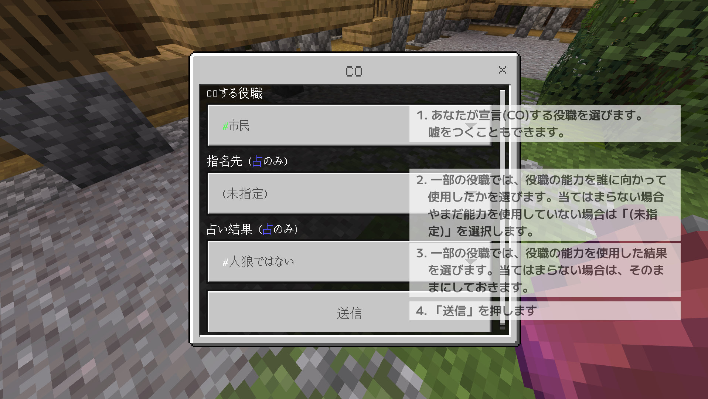

# 会議

マイクラ人狼内での会議について説明します

> 下にスクロールしてください。次のページに進むことができるボタンがあります。

マイクラ人狼にも、カードの人狼ゲームと同じような、誰が人狼かをみんなで話し合って推理する「会議」があります

### ステージ中央のボタンを押すと会議が始まります

ステージ上に1箇所設置されたボタンを押すことで、会議が始まります。ボタンを押すのは、生存者であれば誰でも構いません。
ただし、次の場合は会議を開始**できません**。
 - ゲーム開始直後のクールタイム
 - 前回の会議が終了してすぐ(このページの下部で説明)
 - サボタージュ(別のページで説明)中

### 会議中は物理攻撃ができません

会議中は、弓や特殊アイテムなどで他のプレイヤーを倒すことはできません。
ただし、他人を倒すことができるような能力がある役職については、能力を使用できるものと使用できないものがあります。

### 会議中は生存者のチャットやVCの制限が解除されます

会議中は、全ての生存者同士でチャットやVCを行うことができます。
ただし、死者の声は生存者には聞こえません。死者が生存者にチャットを行うこともできません。

### 会議中のみ配布されるアイテムがあります

会議中は、**金インゴット**(投票カード)と**レンガ**(COカード)が配布されます。   
これらのアイテムは、会議終了時(または投票時間の終了時)に回収されます。
使用方法は後ほど説明します。

### 毎度の会議で、投票により誰か一人を処刑します

カードの人狼ゲームのように、マイクラ人狼にも投票があります。  
会議の参加者がもっとも処刑したいプレイヤー1人を指名し、会議開始から一定時間が経過した時点で最多票を得たプレイヤーが処刑されます。
先述した金インゴット(投票カード)を持って地面を右クリックまたはタップすることで投票できます。
また、投票時間内であれば、投票をやり直すこともできます。
投票を行わなかった場合は無効票となります。多くの人が投票を行わなかった場合、少数の投票で処刑先が決まりますので注意してください(無効票が過半数を占めても投票はスキップしません)。

### 同数票の場合は処刑されません

会議で2人以上が同じ数の表を得た場合は、どちらも処刑されずに会議が終了します。  
全てのプレイヤーが投票しなかった場合も同様に誰も処刑されません。

### 投票先は開示されます

投票時間の終了時(処刑時)に、誰が誰に投票したかが会議参加者全員に公表されます。

### レンガを使ってCOできます

自分の役職を他のプレイヤーに宣言することをCO(Coming Out)といいます。COでは嘘をつくこともできます(例えば人狼が素直に自身が人狼であるとCOした場合は、すぐに投票で処刑されるでしょう)。  
一般的にカードの人狼ゲームではCOは口頭で行いますが、よもぎサーバーのマイクラ人狼ではCOをサポートするシステムがあります。  
レンガ(COカード)を持って地面を右クリックまたはタップすると、CO画面が開き、そこで操作を行うことでCOができます。
一部の役職では、能力を誰に向かって使用したかも併せてCOできます。
また、会議時間内であれば、COをやり直すこともできます。

### プレイヤーのCOの一覧が画面左下に表示されます

誰がどの役職をCOしたかの一覧が、ゲーム画面の左下に表示されます。表示はCOカードを使ってCOをした場合のみ行われ、口頭(vcやチャット)でCOした場合は表示されません。
基本的には、COは会議外でも引き続き表示されます。ただし、会議外にCOを変更することはできません。

### 会議終了後は、ステージ上にランダムスポーンします

会議が終了すると、ゲーム開始時と同様にステージ上に複数あるスポーン地点にランダムにスポーンします。ただし、特殊アイテムは配布されません。
また、会議中は全員に届いていたVCやチャットも会議開始前と同様の公開範囲に戻ります。

### 会議終了後すぐは会議を開始できません

会議にはクールタイムがあり、会議終了後すぐに再度会議を開始することはできません。
会議が開始可能になるまでの残り時間は、会議開始ボタンを押すことで確認できます。
