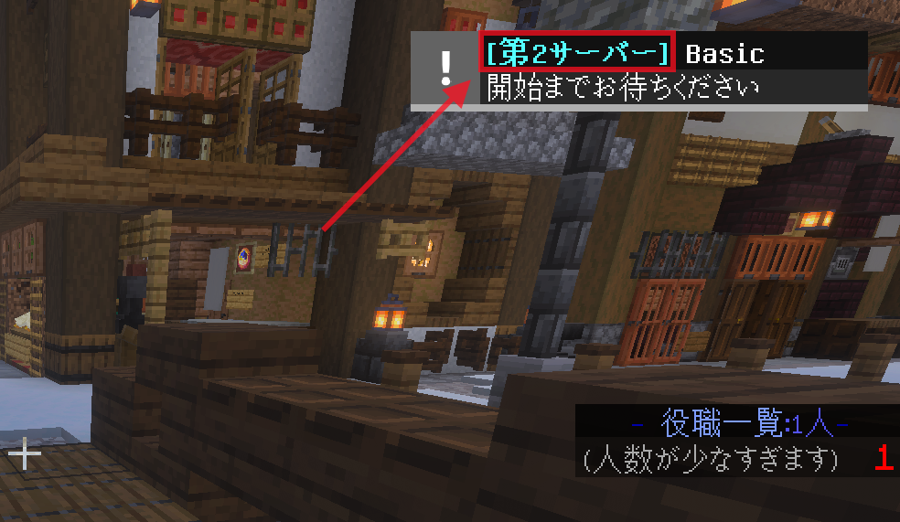
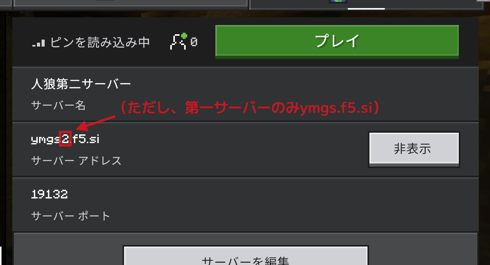
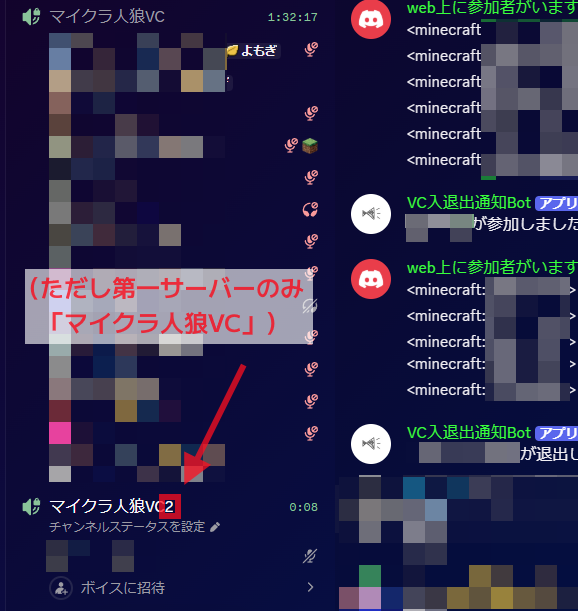
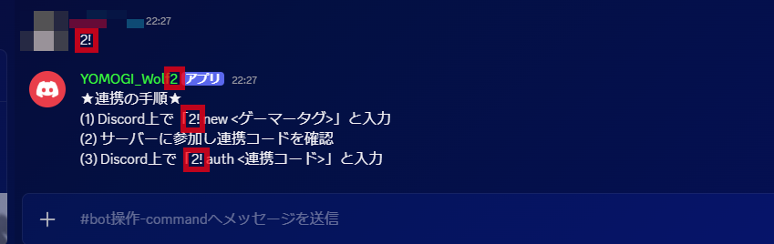

# サーバー分割

マイクラ人狼ではサーバーの参加人数が多い際、全く同じ機能を持ったサーバーを複数台稼働させ、ゲームを並列で行います。  
各サーバーの内容は、後述する「サーバーID」を除き、全く同じです。

# サーバーを分割する基準

サーバー分割は、以下の際に行います
 - いずれかのサーバーの参加人数が15人になった際
 - 第1サーバーと第2サーバーの両方の参加人数が12人以上になった際
 - 複数人が「銃撃戦」のプレイを希望しており、かつ銃撃戦のプレイを希望する人が退出しても人狼ゲームが引き続き進行可能な際
 - その他、分割「後」の全てのサーバーの参加人数が7人以上となる見込みであり、かつ分割を行うことが合理的であると判断した際

# サーバーID
各サーバーには1から5の「サーバーID」がついています。  
サーバーIDが1のサーバーを「第1サーバー」、サーバーIDが2のサーバーを「第2サーバー」... と呼ぶことがあります。  

サーバーIDは様々なところで確認することができます。  

人狼サーバーは全てのサーバーの機能が全く同じであるため、例えば第2サーバーが稼働しているときは第2サーバーを使用して連携操作を行うこともできます。  
ただし、最も安定して稼働しているサーバーは第1サーバーであるため、原則として連携操作には第1サーバーを使用することを推奨しています。
